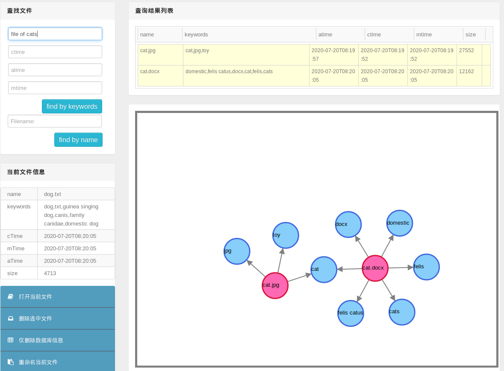

# 预调研
## 目录
- [往年项目简介](#往年项目简介)
  - [2018年](#2018年)
  - [2019年](#2019年)
  - [2020年](#2020年)
  - [2021年](#2021年)  2022-03-08 by 张子辰
- [感兴趣方向的初步调研](#感兴趣方向的初步调研)
  - [文件系统与数据库](#文件系统与数据库) 2022-03-09 by 陈建绿
    1. [2017 x-DFS](#1-2017-x-DFS)
    2. [2018 x-satu](#2-2018-x-satu)
    3. [2018 x-GBFS](#3-2018-x-GBFS)
    4. [2019 x-Erasure-Code-Improvement-based-on-ceph](#4-2019-x-Erasure-Code-Improvement-based-on-ceph)
    5. [2020 x-dontpanic](#5-2020-x-dontpanic)
    6. [2020 x-GDBFS](#6-2020-x-GDBFS)
    7. [2020 x-gkd](#7-2020-x-gkd)
    8. [2021 x-DisGraFS](#8-2021-x-DisGraFS)
    9. [2021 x-NBFS](#9-2021-x-NBFS)
    10. [MogoDB](#10-MongoDB)
    11. [GirdFS](#11-GirdFS)

- [初步构想](#初步构想)
  - [分布式文件系统1](#分布式文件系统1) 2022-03-08 by 张子辰 **【已被否决 2022-03-08 by 邢凯】**
  - [分布式文件系统2](#分布式文件系统2) 2022-03-09 by 张子辰 **【已被否决 2022-03-10 by 邢凯】**


## 往年项目简介

注：2018~2020年的项目参考了 [往届OSH课题调研报告.md](https://github.com/OSH-2021/x-DisGraFS/blob/main/docs/%E5%89%8D%E6%9C%9F%E8%B0%83%E7%A0%94%E5%86%85%E5%AE%B9/%E5%BE%80%E5%B1%8AOSH%E8%AF%BE%E9%A2%98%E8%B0%83%E7%A0%94%E6%8A%A5%E5%91%8A.md)。

### 2018年

#### X-wyj-1

- 小组成员：徐直前、吴永基、黄子昂、金朔苇 
- 项目简介：基于CRDT的多人实时协作编辑器
- 关键词：[CRDT](https://hal.inria.fr/hal-00932833/document), 实时文本协作, 所见即所得（针对Markdown和Latex)

#### X-Doudou

- 小组成员：何纪言、邓胜亮、缑慧星、赵敏帆、曾明亮
- 项目简介：Cunik 是一个面向开发人员和系统管理人员的平台，用于方便构建 Unikernel 应用、与其他必需内容一起打包、分发，从 CunikHub 轻松获取已构建好的镜像，快速部署和运行应用。
- 关键词 ：[Unikernel](http://unikernel.org/), [Cunik](https://github.com/Cunik/Cunik-engine), 云计算, 虚拟化
- 注：之后借鉴该课题的课题有：[x-orz](#（3）x-orz)。

#### X-yeahtiger

- 小组成员：隆晋威、吴昊、伊昕宇、魏天心
- 项目简介：该项目旨在为用户提供一个热部署的解决方案，让用户能在不对源码进行修改的情况下，使用本项目工具对程序进行热部署（即在不重启程序的情况下对程序进行更新）。
- 关键词：[热部署](https://baike.baidu.com/item/%E7%83%AD%E9%83%A8%E7%BD%B2)
- 注：该课题方向在历年中较为少见。

#### X-ccggw-2

- 小组成员：柴磊、顾健鑫、归舒睿、吴豫章、陈俊羽
- 项目简介：本项目基于 Linux 包管理工具链 dpkg 和 apt，在此之上建构了一个 P2P 的分布式网络，以获得更高速的下载和高度的可用性。每一个用户，都作为节点共享本机已经安装好的软件包，并也可以从其他用户处获得新软件包的下载和更新。
- 关键词：分布式网络, 包管理器
- 注：该课题涉及网络的知识较多，如选择该方向需先进行相关的知识储备。

#### X-oalad

- 小组成员：邓龙、戴路、吴紫薇、徐煜森、于颖奇 
- 项目简介：本项目旨在建立一个低成本的新方式，利用简单的头戴设备或者桌面设备（包括设备自带设备，如摄像头），对用户的视线信息做出分析，提取出有效信息作为机器输入，从而作为一种新的机器控制方法。具体地说，希望能从用户眼部信息中，实时的定位用户关注的屏幕区域、进行注视检测、提供辅助阅读等功能。
- 关键词：嵌入式, 可穿戴设备, 图像处理, 人机交互
- 注：该课题方向在历年中较为少见。

#### X-zos

- 小组成员：冉礼豪、胡煜霄、戈惊宇、任正行、管修贤
- 项目简介：通过设计 specialized monitor 进一步提高 unikernel 的性能，并改进 unikernel 调试方面的局限性。
- 关键词：[Unikernel](http://unikernel.org/), 云计算, 虚拟化

#### X-GBFS

- 小组成员：丁峰、⽜⽥、谢灵江、张⽴夫
- 项目简介：开发一种基于知识图谱的相关知识对计算机的个⼈⽂件数据进⾏表⽰的文件系统。这项⼯作主要的⽬的在于弥补传统⽂件系统⽆法表⽰的复杂语义关系的缺陷。即使⽤基于知识的⽂档表⽰⽅案，使得⼀篇⽂章不再只是由⼀组代表词汇的字符串表⽰，⽽是由⽂章的实体及其复杂语义关系表⽰。
- 关键词：GBFS 图文件系统, 语义分析
- 注：知识图谱，语义分析算比较新颖的想法。

### 2019年

[返回目录](#目录)

#### x-xdp-on-android

- 小组成员：龚平、王怡萱、魏剑宇、黄展翔、罗极羽
- 项目简介：该项目是将 XDP 移植至安卓平台，并进一步通过 XDP 在安卓上实现网络处理相关的应用。
- 关键词：[XDP](https://tonydeng.github.io/sdn-handbook/linux/XDP/), 移动操作系统, Android, 网络处理
- 注：涉及移动操作系统的课题较为少见，该课题可作为移动操作系统方向的参考。

#### x-rust-freetos

- 小组成员：樊金昊、左顺、宁雨亭、黄业琦、张俸铭、雷思琦
- 项目简介：使用 Rust 语言改写 FreeRTOS 操作系统
- 关键词：Rust, [实时操作系统FreeRTOS](https://freertos.org/)
- 注：改写某个操作系统的课题较为少见，该课题可作为相关方向的参考。

#### x-monthly-subscription

- 小组成员：赵家兴、陶柯宇、付佳伟、陈昂、李喆昊
- 项目简介：对计算机在网络包处理上进行非冯化改造，绕过 CPU 与操作系统内核，直接在网卡上对网络包进行数据流驱动的实时处理。目标是纳秒级的延迟。
- 关键词：网络, 高性能, 体系结构
- 注：该课题涉及网络的知识较多，如选择该方向需先进行相关的知识储备；试图改进计算机的体系结构也是可行的方向。

#### x-spider

- 小组成员：詹佑翊、曹宇昂、万琪、琚泽谦、张衎
- 项目简介：本项目旨在将[Rain](https://github.com/substantic/rain)（一个开源的Rust语言编写的分布式计算框架）从Linux系统移植到raspbian系统上，使树莓派成为分布式计算节点，能够接收、执行和返回服务器分发的计算任务；缩减和优化Rain代码，使其更加轻量、快速，并且能够长期在树莓派的后台运行，不影响其他运行在树莓派上的程序，以此实现对以树莓派为代表的物联网设备的闲置算力的有效利用。如果时间允许，还将尝试对Rain进行裸机编程的改造，提高Rain的运行速度，同时使Rain适用于更多物联网设备。
- 关键词：[Rain](https://github.com/substantic/rain), 分布式计算, 树莓派
- 注：该课题用上了树莓派，在以往课题中较为少见，可以作为相关方向的参考。

#### x-qwq

- 小组成员：彭定澜、陈墨涵、沈巍然、张德鑫、刘旭铠
- 项目简介：该项目是基于 Rust 改造的 seL4 微内核。L4 是一种微内核构架的操作系统内核。seL4 是 L4 微内核系列的一种，经 Haskell 形式化验证并实现为 C。该项目计划将它改写为 Rust，进一步提升安全性。
- 关键词：Rust, [seL4](https://sel4.systems/)
- 注：与Rust语言相关的课题在2019年的出现频率很高。

#### x-Erasure-Code-Improvement-based-on-ceph

- 小组成员：张灏文、陈云开、毕超、刘硕、张铭哲 
- 项目简介：在ceph的平台上对纠删码插件进行改进，使用柯西矩阵进行编码，使用 Intel 的 SIMD 指令集机型矩阵计算的加速，对于不同的数据进行分层的管理，达到更好的容错性和可用性。
- 关键词：分布式文件系统, [ceph](http://docs.ceph.org.cn/), erasure code

#### x-i-m-feeling-lucky

- 小组成员：刘云飞、李维晟、汪若辰、余磊
- 项目简介：使用 Rust 编程语言写一个能在树莓派上运行的操作系统。
- 关键词：Rust, 树莓派
- 注：重头开始写一个操作系统也算一个方向。

#### x-ridiculous-includeos

- 小组成员：刘紫檀、张博文、虞佳焕、汤兖霖
- 项目简介：在 ARM 架构上构建 IncludeOS 系统
- 关键词：[IncludeOS](https://www.includeos.org/), ARM

### 2020年

[返回目录](#目录)

#### x-dontpanic

- 小组成员：罗丽薇、邱子悦、袁一玮、余致远
- 项目简介：本项目旨在实现可用性高的基于互联网网页的小型分布式文件系统。在已有的项目的基础上，希望实现容器化服务器端、多用户权限支持、更高效的文件传输、减轻中央服务器负担、提高文件安全性和可用性等优化，做出可用性高的“私人网盘”。
- 关键词：互联网网页, 分布式文件系统, 容器化技术（[Docker](https://docs.docker.com/))
- 注：此项目为在[17级项目](#1.17级优秀课题)的基础上作出的改进。

#### GDBFS

- 小组成员：高楚晴、王幸美、王章瀚、万嘉诚、黄致远
- 项目简介：基于图数据库的着重人与文件系统交互的GDBFS（Graph Database File System）
- 关键词：图文件系统, 图数据库, 新型文件系统[DBFS](http://dbfs.sourceforge.net/)

#### x-orz

- 小组成员：夏寒、王原龙、张万林、李平赫
- 项目简介：本项⽬将一般网络程序中的任务拆分为常用的服务，不同服务集成到不同的Unikernel中。通过合理地编排调度Unikernel集群，将各种并发的服务组合起来，处理任务请求，从⽽而充分利利⽤用多核/多CPU资源，提高系统性能，同时⼜不破坏Unikernel原有的轻量、安全的特性。
- 关键词：[Unikernel](http://unikernel.org/), 云计算, 虚拟化, 高性能计算

#### x-gkd

- 小组成员：雷雨轩、裴启智、刘逸菲、曲阳、孙一鸣
- 项目简介：该项目通过高效、安全的Rust语言对17级项目“基于互联网网页的小型分布式文件系统”进行改写，并用极具计算效率和兼容性的WebAssembly来与JavaScript交互实现更高效的网页前端逻辑，并用WebAssembly把Rust写的分布式文件系统程序的包装，再通过Node.js部署Web服务器, 最终在Node.js(V8引擎)实现跨平台的，可提供移动式文件访问的分布式文件系统，并在性能、兼容性、创新性上取得突破。
- 关键词：Rust, 网页前端, 分布式文件系统
- 注：此项目为在[17级项目](#1.17级优秀课题)的基础上作出的改进。

#### x-chital

- 小组成员：丁垣天、叶之帆、何灏迪、郑在一
- 项目简介：参考 gVisor(一种轻量级的容器技术) 的实现，利用系统调用劫持的方法，实现进程级的虚拟化。在gVisor的基础上，避免 go 语言运行时的开销，为程序提供轻量高效的运行环境。
- 关键词：[gVisor](https://gvisor.dev/), 虚拟化

### 2021年

[返回目录](#目录)

#### x-DisGraFS

- 小组成员：彭怡腾、彭浩然、黄晋超、朱一鸣、袁玉润
- 项目简介：构建分布式图文件系统（DisGraFS, Distributed Graph Filesystem），在分布式机群的规模上，图文件系统能够实现所管理的信息规模的扩大与各类资源的均衡分配，从而在超出人类记忆能力的信息规模上体现出图文件系统相对于传统树形结构的优越性。通过主机（Master）对从机（Slave）的存储空间以及算力的合理调度以及在主机的指导下用户与从机之间的直接对接，我们的项目期望实现一个高效的、用户友好的、高可扩展性的分布式图文件系统，以进一步拓展图文件系统在未来应用中的可能性。
- 关键词：分布式文件系统, 图文件系统
- 注：该项目借鉴了GDBFS和x-gkd，并且创造性地将图文件系统和分布式文件系统结合。

#### x-seLVM

- 小组成员：张一方、陶思成、吴晨源、林晨阳

- 项目简介：x-seLVM项目旨在利用Lua虚拟机，使seL4内核对平台的依赖转化为Lua虚拟机对平台的依赖，从而扩大seL4微内核的平台适用范围。主要的技术为将内核的部分接口进行改写，并将其注册到Lua程序中，实现运行在Lua虚拟机上的seL4内核。

- 关键词：Lua语言, 虚拟化, [seL4](https://sel4.systems/)

#### x-unipanic

- 小组成员：高泽豫、谢强、蔡智臻、徐怡

- 项目简介：云计算场景下，Unikernel具有轻量、安全、快速的优势，但它被一些不足限制了应用范围。 本项目旨在通过提升Unikernel的二进制兼容性，来扩大它的应用范围。 我们主要参照了已有的Hermitux项目，在此基础上做出了两点改进：
  1. 增加了支持fork()系统调用，从而使Unikernel支持多进/线程；
  2. Hermitux项目改写了系统调用以减少上下文切换，提高速度；我们组修改了改写系统调用的逻辑，从而能改写更多的系统调用，进一步提高速度。
- 关键词：UniKernel, 进程调度

#### x-RIG

- 小组成员：胡冰、李清伟、陈文杰、张栋澈、徐昊
- 项目简介：基于rust-freertos的版本更迭和改进，尝试使rust-freertos能够更好地用于生产生活中。融入一部分sel-4的安全特性到freertos，以期望增强其安全性。
- 关键词：rust, FreeRTOS, seL4
- 注：直接改进往年的项目也是可以接受的。

#### x-KATA-Unikernel

- 小组成员：钟书锐、李思逸、赵辰阳、谢新格、胡乐翔
- 项目简介：利用unikernel得天独厚的轻量和攻击面小的特性，结合虚拟化技术，为FaaS（Function As A Service）场景下的云服务提出一种解决方案：从客户端提交代码，到云平台进行Serverless运算。采用KVM 的虚拟机接口，在虚拟化环境中以unikernel减少资源开销，达到空间的高效利用和速度的极限提升。
- 关键词：UniKernel, 虚拟化, 云计算

#### x-NBFS

- 小组成员：陈耀祺、黄科鑫、梁峻滔、郑师程
- 项目简介：设计和实现一个针对改进Nvme SSD读写性能的文件系统，并基于SPDK工具实现了该文件系统，同时提供了两套用于访问底层设备的接口，一套是用于FUSE挂载的通用接口，另一套是用于专用应用的专用接口。
- 关键词：文件系统, 固态硬盘
- 注：为特定硬件设计文件系统的课程项目非常少见，本项目可以作为该方向的参考。

#### x-sBPF

- 小组成员：陈思睿、梁恒宇、吕泓涛、汤力宇
- 本组的项目是一个轻量级的文件系统沙盒，通过劫持文件访问相关的系统调用，实现对文件的保护。项目的特色在于本项目的沙盒程序是一段动态植入内核空间的kernel代码，可以最小化反复切换特权级别带来的性能损失，并且保留了用户态程序级别的自由度和灵活性。本项目目前已经在同一个框架下实现了三种不同的文件保护模式，可以灵活地为使用者选择，满足不同类型的数据保护需要。本项目还通过引入cgroup，实现了进程资源分配的限制，提高了对系统的整体保护。
- 关键词：虚拟化, 容器, 文件保护, 系统安全
- 注：该项目的报告使用LaTeX排版，在撰写报告时可以参考。

## 感兴趣方向的初步调研

### 文件系统与数据库

<!--TODO: 报告未完工-->

#### 1. 2017 x-DFS

[返回目录](#目录)

[基于互联网网页的小型分布式文件系统](https://github.com/IngramWang/DFS_OSH2017_USTC)。该项目设计了一个新型的家用的分布式文件系统，可以利用所有安装了项目客户端的机器共享存储空间存储文件碎片，利用一个专用的服务器维持系统的状态并协调各个客户机处理请求，利用互联网网页访问整个文件系统。

文件系统的数据备份机制为纠删码。

该项目的详细设计报告中指出：“除了备份机制，为了进一步提高文件的可用性”，他们期待“把目前已经十分成熟的网盘资源整合进本项目设计的分布式文件系统，这种实现方式在目前常见的分布式文件系统中尚未出现”。

他们的分布式文件系统的模块组成说明：


> **相关资料**：
>
> 纠删码讲解参考文章：[纠删码Erasure Coding——简书博客](https://www.jianshu.com/p/acf0f392bac9?utm_campaign=studygolang.com&utm_medium=studygolang.com&utm_source=studygolang.com)。

#### 2. 2018 x-satu

[返回目录](#目录)

[面向物联网的文件系统](https://github.com/OSH-2018/X-satu)。主要功能为将不同类型的网络连接持久化存储在文件中，从而在网络数据高效传输的同时，可以做到近乎实时的缓冲和备份，并且对用户提供一个一致且易用的接口。实现可靠、实时、可伸缩、可扩展、资源消耗低、面向流数据优化且能与网络集成的嵌入式文件系统，适用于资源有限的无线传感器网络的数据采集工作。

#### 3. 2018 x-GBFS

[返回目录](#目录)

 [一种基于知识图谱的相关知识对计算机的个⼈⽂件数据进⾏表⽰的文件系统](https://github.com/OSH-2018/X-GBFS)。在这种表示下，用户可以对文件进行加、减标签的操作，可以实现根据标签查找文件的操作，可以实现文件的推荐功能来获取相关文件信息，这些操作在一定程度上可以优化用户的文件系统使用体验。

> **相关资料**：
>
> FUSE介绍: [FUSE——维基百科](https://zh.wikipedia.org/wiki/FUSE)
>
> FUSE讲解: [FUSE文件系统——CSDN博客](https://blog.csdn.net/feelabclihu/article/details/109396707)
>
> Neo4j参考资料：[Neo4j详解——CSDN博客](https://blog.csdn.net/Dream_bin/article/details/104470275)
>
> CN-DBpedia介绍及使用说明: [CN-DBpedia——Github`Languageresources`项目介绍](https://languageresources.github.io/2018/04/19/%E6%9D%8E%E5%8D%8E%E5%8B%87_CN-DBpedia/)
>
> Socket通信讲解：[超详细的Socket通信原理和实例讲解——网络博客](https://network.51cto.com/article/608725.html)

#### 4. 2019 x-Erasure-Code-Improvement-based-on-ceph

[返回目录](#目录)

[在ceph的平台上对纠删码插件进行改进](https://github.com/OSH-2019/x-Erasure-Code-Improvement-based-on-ceph)。该项目将纠删码插件改进为使用柯西矩阵进行编码，使用 Intel 的 SIMD 指令集机型矩阵计算的加速，对于不同的数据进行分层的管理，达到更好的容错性和可用性。

> **相关资料**：
>
> 纠删码讲解参考文章：[纠删码Erasure Coding——简书博客](https://www.jianshu.com/p/acf0f392bac9?utm_campaign=studygolang.com&utm_medium=studygolang.com&utm_source=studygolang.com)
>
> Ceph介绍：[Ceph(软件)——维基百科](https://en.wikipedia.org/wiki/Ceph_(software))
>
> Ceph讲解：[分布式存储Ceph讲解——博客园博客](https://www.cnblogs.com/zhou2019/p/10750648.html)

#### 5. 2020 x-dontpanic

[返回目录](#目录)

[可用性高的基于互联网网页的小型分布式文件系统](https://github.com/OSH-2020/x-dontpanic)。该项目是2017年项目x-DFS的优化设计，优化实现了容器化服务器端、多用户权限支持、更高效的文件传输、减轻中央服务器负担、提高文件安全性和可用性。本项目的介绍指出，2017年的项目x-DFS的数据传输是中心化的，所有文件都要经过中央服务器的中转，有一些不利之处。

该项目在设计上体现出了和NAS、IPFS的互补性以及独有的优势:

|            |                IPFS                |                    Their FS                    |
| :--------: | :--------------------------------: | :--------------------------------------------: |
| 数据安全性 | 无身份验证，拿到哈希值就能拿到文件 | 目录节点可进行身份验证，用户只能访问自己的文件 |
| 数据可靠性 |         无法保证足够可用源         |      目录节点可协调冗余备份，保证备份充足      |

IPFS 在去中心化上做了充分工作，但同时因为完全去除了中心化的元素，它仍有需要解决的问题：

- 存储数据的安全性：缺少验证用户身份的过程，任何人只要拿到文件的哈希值就能获取文件内容。
- 数据可靠性：IPFS 系统虽然有激励层，但是无法保证一份数据能够有**足够的备份**在系统中存储，从而有可能导致数据丢失。

而该项目在设计上**选择保留目录节点**，避免了上述两大问题，且具有 IPFS 的存储节点去中心化的优势。

|          |              NAS               |              Their FS              |
| :------: | :----------------------------: | :--------------------------------: |
| 设备限制 |            专有设备            | 普通设备运行客户端即可，跨平台兼容 |
| 扩容限制 | 单台扩容有限，多台难以无缝合并 |              无缝扩展              |

NAS 的局限性在于它的系统使用专有设备，前期安装和设备成本较高。同时它在可扩展性上亦面临一定的限制，因为单台 NAS 的扩容是有限的，增加另一台 NAS 设备非常容易，但是不易将两台 NAS 设备的存储空间**无缝合并**。

而在该项目中，存储节点只需持续运行项目的 Java 跨平台程序，不必使用专有设备，并且项目在可扩展性上不存在 NAS 面临的问题。

>  **IPFS**
>
>  IPFS 全称 Interplanetary File System，意为星际文件系统。它创建了分布式存储和共享文件的网络传输协议，意在将所有具有相同文件系统的计算设备连接在一起。IPFS 有如下特性：
>
>  1. 使用区块链技术，使 IPFS 实现了文件存储的持久性，相比中心化的服务更难被篡改和封禁。
>  2. IPFS 在文件传输上采取 P2P 模式， 充分地利用了个节点之间的带宽资源，并且无需一个强大的中央服务器来满足大量服务，达到了高效和低成本。
>  3. 每一个上传到 IPFS 的文件会被分配一个内容的哈希作为地址，访问只需验证哈希。
>  4. Filecoin 是 IPFS上的一个代币，用来激励用户贡献闲置的硬盘。它通过算法确定工作量发放。简单来说，拥有的硬盘容量越大，获取的 Filecoin 越多。
>
>  **NAS**
>
>  NAS 全称 Network Attached Storage，是一种可以通过网络访问的专用数据存储服务器，它可以将分布、独立的数据进行整合，集中化管理，以便于对不同主机和应用服务器进行访问的技术。

> **相关资料**：
>
> IPFS讲解：[认识IPFS——阿里云开发者社区博客](https://developer.aliyun.com/article/726565)
>
> IPFS使用教程：[IPFS 使用入门](https://segmentfault.com/a/1190000017545827)
>
> NAS讲解：[NAS详解](https://zhuanlan.zhihu.com/p/52471966)

#### 6. 2020 x-GDBFS

[返回目录](#目录)

[基于图数据库的着重人与文件系统交互的文件系统](https://github.com/OSH-2020/GDBFS)。该项目有些像2018年项目x-GBFS项目的优化重写。该项目使用Django实现Web前端，界面更加美观，2018年的x-GBFS项目则实现的是命令行操作。二者都使用了Neo4j搭建图数据库。

该项目的Web操作界面：



> **相关资料**：
>
> Neo4j参考资料：[Neo4j详解——CSDN博客](https://blog.csdn.net/Dream_bin/article/details/104470275)
>
> Django教程：[Django 教程——菜鸟教程](https://www.runoob.com/django/django-tutorial.html)

#### 7. 2020 x-gkd

[返回目录](#目录)

[基于 Rust 和 WebAssembly 的分布式文件系统](https://github.com/OSH-2020/x-gkd/blob/master/docs/conclusion.md)。本项目是2017年项目x-DFS的改写，使用Rust语言对client端和server端完全改写，重用原项目的web前端。该项目名称中提到的`WebAssembly`并没有在项目中使用，其最终的报告中指出WebAssembly有诸多限制，Rust不能与WebAssembly共同工作。

> **相关资料**：
>
> WebAssembly介绍：[WebAssembly简介](https://zhuanlan.zhihu.com/p/42718990)

#### 8. 2021 x-DisGraFS

[返回目录](#目录)

[分布式图文件系统](https://github.com/OSH-2021/x-DisGraFS)。该项目可看作是2018年项目x-GBFS、2020年项目x-GDBFS的优化设计，他们提出了分布式图文件系统的概念，**统一了单机图文件系统和分布式文件系统的优点**。将图结构与思想应用于分布式文件系统上面，使得分布式图文件系统兼具图文件系统方便用户快速搜索，模糊搜索，查找相关文件的特点以及分布式文件系统的海量文件存储，云存储的特点。

该项目在建立图数据结构时，考虑到多用户操作文件系统联想到的关键词会有可能不同，从而提出使用用机器对文件打标的想法，让不了解其他用户命名习惯的用户也能在自己并不熟悉的大规模文件系统下快速检索到自己想要的文件。

此外，分布式图文件系统中，文件、数据库的维护任务以及关键词提取的任务可以不再集中于一台机器，而是分配到不同的设备上完成。主、从机分工合作，实现算力、存储和网络资源的合理分配，最大化地利用资源。

> **相关资料**：
>
> Neo4j参考资料：[Neo4j详解——CSDN博客](https://blog.csdn.net/Dream_bin/article/details/104470275)
>
> Ray讲解：[Ray 分布式计算框架详解](https://xie.infoq.cn/article/1bf9d6404f2c1536102c8d45a)
>
> JuiceFS介绍：[JuiceFS 是什么？——JuiceFS官网](https://juicefs.com/docs/zh/cloud/intro/)
>
> JuiceFS教程：[JuiceFS 云服务快速上手指南——JuiceFS官网](https://juicefs.com/docs/zh/cloud/getting_started/)
>
> JuiceFS讲解：[JuiceFS框架介绍和读写流程解析——博客园](https://www.cnblogs.com/luohaixian/p/15374849.html)

#### 9. 2021 x-NBFS

[返回目录](#目录)

 [针对改进 NVMe SSD 读写性能的文件系统](https://github.com/OSH-2021/x-NBFS)。该项目在改进 NVMe SSD 性能的同时，基于 SPDK 工具实现该文件系统，同时提供了两套用于访问底层设备的接口，一套是用于`FUSE`挂载的通用接口，另一套是用于专用应用的专用接口。

两套接口的特点如下：

- 通用接口：以通用性为第一目标，可对接`SPDK`提供的`FUSE`插件，进而可被正常软件调用，在此基础上，利用`SPDK`的特性提高其性能。
- 专用接口：以性能提升为第一目标，直接利用`SPDK`平台搭建一套异步、无锁、并发的文件系统，实现我们所设想的性能提升。

> **相关资料**：
>
> NVMe介绍：[NVMe SSD是什么？——网络博客](https://blog.51cto.com/alanwu/1766945)
>
> FUSE讲解: [FUSE文件系统——CSDN博客](https://blog.csdn.net/feelabclihu/article/details/109396707)
>
> SPDK讲解：[SPDK详解——CSDN博客](https://blog.csdn.net/weixin_40343504/article/details/88706733)

#### 10. MongoDB

[返回目录](#目录)

<!--TODO：MongoDB的相关调研-->

> MongoDB 是一个基于分布式文件存储的数据库。由 C++ 语言编写。旨在为 WEB 应用提供可扩展的高性能数据存储解决方案。
>
> MongoDB 是一个介于关系数据库和非关系数据库之间的产品，是非关系数据库当中功能最丰富，最像关系数据库的。

#### 11. GirdFS

[返回目录](#目录)

GridFS 是 MongoDB 的一个子模块,使用 GridFS 可以基于 MongoDB 来持久存储文件，并且支持分布式应用(文件分布存储和读取)。

MongoDB文档：[GridFS — MongoDB Manual](https://docs.mongodb.com/manual/core/gridfs/)

##### 简要介绍

用于处理大小超过16M的文件，将其切割成指定大小（默认为255KB）的文档块进行存储；

读取时根据需要对其拼接，不会加载所有内容；

用两个集合进行存储，`fs.files`存储文档相关信息（如文档名称、大小、块大小等），`fs.chunks`存储各文档分块（文档的实际内容）。

##### 实现细节

​		当把一个文件存储到 GridFS 时，如果文件大于 `chunksize` ，会先将文件按照 `chunk` 的大小分割成多个 `chunk` 块，最终将 `chunk` 块的信息存储在 `fs.chunks` 集合的多个文档中。然后将文件信息存储在 `fs.files` 集合的唯一一份文档中。其中 `fs.chunks` 集合中多个文档中的 `file_id` 字段对应 `fs.files` 集中文档`_id`字段。

​		读文件时，先根据查询条件在 `files` 集合中找到对应的文档，同时得到`_id`字段，再根据`_id`在 `chunks `集合中查询所有`files_id`等于`_id`的文档。最后根据`n`字段顺序读取 `chunk` 的`data`字段数据，还原文件。

如下图所示：


fs.files 内容为

```c++
{
 "_id": <ObjectId>,  			// 文档 ID，唯一标识
 "chunkSize": <num>, 		 	// chunk 大小 256kb
 "uploadDate": <timetamp>, 		//文件上传时间 
 "length": <num>,   			// 文件长度
 "md5": <string>,   			// 文件 md5 值
 "filename": <string>, 			// 文件名
 "contentType": <string>,		// 文件的?MIME类型
 "metadata": <dataObject>		// 文件自定义信息
}
```

fs.chunks 内容为

```c++
{
 "_id": <ObjectId>,  // 文档 ID，唯一标识
 "files_id": <ObjectId>,  // 对应 fs.files 文档的 ID
 "n": <num>,      // 序号，标识文件的第几个 chunk
 "data": <binary>   // 文件二级制数据
}
```

##### 相关评价

基于MongoDB，易用易扩展。后者系统老练且成熟稳定；

对于大量大文件的处理效率较高；

不建议用于大量小文件的存储管理；

##### 较大缺陷

无法直接修改文档。如果要修改GridFS里面的文档，只能是先删除再添加 。

##### 参考资料

菜鸟简明版：[MongoDB GridFS | 菜鸟教程 (runoob.com)](https://www.runoob.com/mongodb/mongodb-gridfs.html)

## 初步构想

### 分布式文件系统1

【已被否决】[返回目录](#目录)

去中心化、支持写时复制的分布式文件系统。

#### 特征

1. 使用区块链技术实现完全的去中心化。
2. 将文件切割成大小为1MiB（待定）的数据块。
3. 以数据块自身的SHA-256为密钥，用AES-256算法加密数据块。在**储存区**保存加密后的数据块和加密后的数据块的SHA-256，在**使用区**保存原始数据块的SHA-256和加密后的数据块的SHA-256。
   注：由于是去中心化，这里避免了使用“服务端”和“客户端”。储存区可以位于任何设备上，而使用区保存在本地。
4. 利用写时复制和隐式共享技术，不过度重复储存内容相同的数据块，但是会进行适当的冗余备份。
5. 为数据块保存引用计数，引用计数达到0的数据块将被从储存区移除。

#### 待定内容

1. 缓存。
2. 针对小文件优化。
3. 在远程保存加密后的文件表。

#### 难点

1. 在去中心化前提下，高效获取文件的储存位置。（其实去中心化网络本身就是一个难点。）
2. 垃圾清理，即删去过时的数据块。

#### 参考

[返回目录](#目录)

一名组员的个人计算机上的文件的大小分布（见[allfile_size-sorted](https://github.com/gsxgoldenlegendary/x-LJW/tree/master/references/allfile_size-sorted)）：

| 大小范围 $(-\infty,x]$ (byte) | 频率     |
| ----------------------------- | -------- |
| 0                             | 11.593%  |
| 16                            | 11.908%  |
| 32                            | 15.196%  |
| 64                            | 17.008%  |
| 128                           | 18.635%  |
| 256                           | 22.253%  |
| 512                           | 27.781%  |
| 1024 (1KiB)                   | 36.651%  |
| 2048                          | 51.502%  |
| 4096                          | 63.651%  |
| 8192                          | 72.140%  |
| 16384                         | 79.910%  |
| 32768                         | 85.931%  |
| 65536                         | 90.163%  |
| 131072                        | 92.981%  |
| 262144                        | 94.804%  |
| 524288                        | 96.352%  |
| 1048576 (1MiB)                | 97.341%  |
| 2097152                       | 98.072%  |
| 4194304                       | 99.042%  |
| 8388608                       | 99.724%  |
| 16777216                      | 99.880%  |
| 33554432                      | 99.935%  |
| 67108864                      | 99.963%  |
| 134217728                     | 99.983%  |
| 268435456                     | 99.992%  |
| 536870912                     | 99.995%  |
| 1073741824 (1GiB)             | 99.997%  |
| 2147483648                    | 99.998%  |
| 4294967296                    | 99.999%  |
| 8589934592                    | 100.000% |

```c++
//find / -type f -printf "%s\n" > allfile_size
#include <fstream>
#include <map>
#include <iomanip>
using namespace std;

int main()
{
    map <size_t,size_t> sizes;
    ifstream fin("allfile_size");
    size_t cnt=0;
    while(fin)
    {
        size_t tmp;
        fin>>tmp;
        ++sizes[tmp];
        ++cnt;
    }
    double r_cnt=100.0/cnt1;
    fin.close();
    ofstream fout("allfile_size-sorted");
    size_t prefix_cnt=0;
    fout<<setprecision(3)<<fixed;
    for(auto &i:sizes)
        fout<<setw(15)<<i.first<<setw(10)<<i.second<<setw(10)<<(prefix_cnt+=i.second)*r_cnt<<"%\n";
}
```


### 分布式文件系统2

【已被否决】[返回目录](#目录)

速度不会明显慢于机械硬盘的对用户透明的分布式文件系统。

当前的计算机的储存设备的层次为，寄存器—缓存—内存—硬盘（可以细分为固态硬盘和机械硬盘，但是在实际应用中，两者处在同一个层次，固态硬盘常常被作为最终的储存介质，而不是被用来加速机械硬盘的访问），而专用的储存服务器可以提供比硬盘空间更大、成本更低、更持久但访问更慢的储存，因此专用的存储服务器有可能成为计算机存储系统的一个层次。

#### 特征

1. 能够借助FUSE挂载，近似POSIX兼容（不兼容之处会在下面列出）。现在的[GlusterFS](https://docs.gluster.org/en/latest/)、[IPFS](https://docs.ipfs.io/)等都支持这一特性。
2. 提供专用的API，以支持更多特有操作。
3. 利用访问局部性建立文件缓存，以使绝大部分IO操作的性能达到硬盘的速度和响应时间。
   观察：
   - 用户倾向于在短时间内频繁地访问某个目录下的文件，比如应用程序执行时会频繁地在应用程序的目录下读取资源文件，人在开发项目时会频繁修改项目目录下的文件。
   - 用户倾向频繁地修改一个文件，比如写实验报告时反复保存。
4. 在服务端维护文件的普及率。对于长度大于`WORTH_SHARING_LIMIT`且权限不是`??0`的文件，将拥有人数超过`COMMON_FILE_LIMIT`的文件认定为普遍文件，将拥有人数超过`POPULAR_FILE_LIMIT`的文件认定为流行文件。其他文件一律视为私有文件（或者是不值得共享的文件）。
5. 将私有文件按读、写频率分为冷文件（读写频率都很低）、静态热文件（写频率低、读频率高）、动态热文件（读写频率都很高）。
6. 普遍文件和流行文件使用自身的散列（本来想用SHA-256，但处于一些考虑决定使用修改过的SHA-2）为key加密（持有散列即可获取文件，方便分享，并降低储存开销）。私有文件使用用户自定义的key加密。
7. 普遍文件和私有文件在专用的储存服务器上储存，流行文件在去中心化网络中储存（可参考[IPFS](https://docs.ipfs.io/)）。（兼顾可用性和存取效率）
8. 冷文件、静态热文件、普遍文件用Reed–Solomon纠错码容错（可以参考2019年的x-Erasure-Code-Improvement-based-on-ceph）。动态热文件和流行文件使用多副本容错（前者占比极小，而且修改频率高，计算纠错码代价过大；后者使用去中心化网络存储，天然具有重复储存的特性）。
9. 以`.\\`开头的目录名被保留（虽然POSIX命名空间允许文件名中出现`\`，但这仍然非常罕见，而两个连续的`\`出现的频率就更低了，所以保留它们不会影响用户体验）。
   - `.\\unsorted`是未整理文件目录，被放到这个目录下的文件会被自动添加内容标签（本地计算标签，远程计算侵犯个人隐私），这能帮助用户可以快速找到这些文件（这借鉴了2020年的GDBFS和2021年的x-DisGraFS的提取文件的内容属性）。
   - `.\\old-<文件名>`是文件的历史版本，只对动态热文件和刚刚发生修改的文件维护，防止用户误修改。
   - `.\\deleted`是最近被删除的文件，以减少误用`rm`带来是损失（`.\\deleted`比传统的`.Trash`更底层）。
10. 未被放入`\\\unsorted`的非私有文件也会被添加内容标签。私有文件不会被自动加标签，因为这会让用户感到自己被计算机支配。
11. 被自动生成的标签可以被手动修改。
12. 建立文件名索引和文件标签索引，用户可以通过这些索引快速搜索到自己像要的文件。

[返回开头](#预调研)

