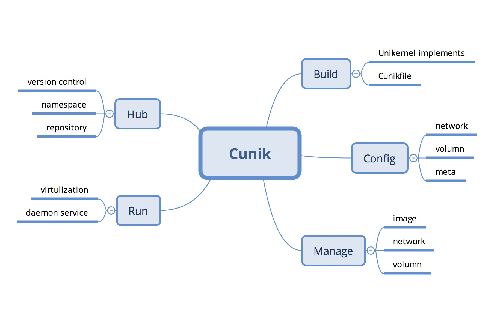
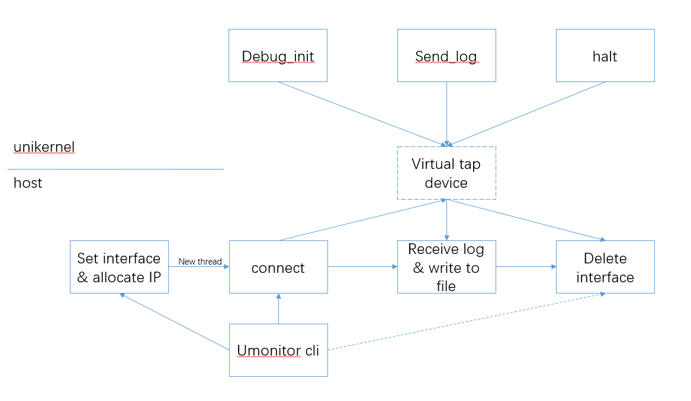
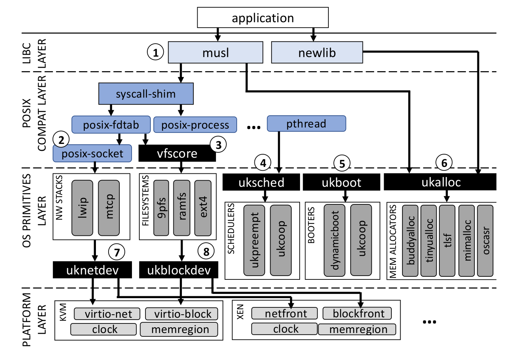

# Unikernel 方向的初步构想

## Unikernel 相关项目

### 1. 2018 X-Doudou

Cunik 是一个面向开发人员和系统管理人员的平台，用于方便构建 Unikernel 应用、与其他必需内容一起打包、分发，从 CunikHub 轻松获取已构建好的镜像，快速部署和运行应用。

融合 Docker 将应用容器化的思想，Cunik 向用户隐藏繁琐的细节，使用户可以轻松地构建、分发、获取和配置 Unikernel 应用，降低开发、部署和运维成本，并可以克服 Unikernel 开发难度高、分发部署困难、对系统管理人员要求高、对现有云计算架构改动大的缺点。

借助 Unikernel 的优势，Cunik 可以使用户轻松获得显著的性能提升和更高的安全性、减小攻击面、降低资源占用，助力云计算发展。

#### 整体布局

#### 运行流程

- 用户通过调用 Cunik API 中的 `Creat`、`Run`、`Stop`、`Remove`、`Inspect` 等 API 接口命令来启动 Cunik-engine。
- Cunik-engine 在接受到命令后，首先会生成一个 Cunik Config，用于生成 Cunik Object。
- 通过Cunik Models，engine 会生成 Cunik Object，并加入到 Cunik Registry 中，或对已有 Cunik Object 进行运行状态的修改。
- 然后，Unikernel Backends 会根据不同的 Cunik Object 选择不同的 Unikernel 实现方式。
- 接下来，根据所选择的 Unikernel 实现方式，并在 Image Regsitry 中查询 Unikernel 应用的 image ，然后由 VM Backends 生成 VM Config。
- VM Hypervisor 接收 VM Config 并选择合适的虚拟机来运行这个 Unikernel 应用。

### 2. 2018 X-zos

Umonitor是一种针对Unikernel的调试工具，旨在在没有传统debug环境的支持下改善Unikernel的调试环境。在保留Unikernel现有优势的基础之上，减少其劣势对开发者使用的影响。

Umonitor利用用户态协议栈建立了host与Unikernel之间的网络通信，从而实现了对Unikernel程序的监控。　　

具体而言，Umonitor实现了：　　

- 批量接收、查看、管理Unikernel程序运行日志
- 在host端以文件的形式保存调试信息
- 多Unikernel同时监控
- 命令行交互

#### 总体结构

#### 可改进之处

设置断点、逐句执行。

> 再进一步，我们的umonitor在运行之后实际上仍然只能被动地接受被调试的unikernel输出的调试信息，这样虽然能够在一次设置后找到对应的错误信息出现的位置，但想要在unikernel运行中途添加调试信息输出或者更进一步的设置断点和逐句执行都还做不到，虽然这些都属于一个完整的调试工具所必须的功能，但是由于实现非常复而且所需知识已经超出现在所学且考虑到时间问题，所以暂时无法完整实现，而当在后面的学习中如果掌握了所需知识，交互式的调试也将会是一个主要的开发方向。

### 2019 x-ridiculous-includeos

IncludeOS 是一个 C++ 的 Unikernel 实现，并可以在 bare-metal 上运行。IncludeOS 提供了丰富的用于网络编程的库，但是目前还不支持在 ARM 上运行。裸机运行的 IncludeOS 相较于 Linux 发行版拥有更快的启动速度，并且减少了进程切换等的无谓开销，代码审计面更小，安全性更高。现有的树莓派的 Unikernel 对网络的支持很弱。在 IoT 领域中，有许多应用场景对延迟的要求十分苛刻，对安全性要求很高。而本项目意在将 IncludeOS 移植到 ARM 上，这样对延迟敏感，安全性要求高的 IoT 应用场景会有很大帮助。

#### 已完成的目标

- 系统构建
- UART 驱动支持
- GPIO 驱动支持
- Frame Buffer 驱动支持
- eMMC & SD Card 驱动支持
- Exception Handler
- MMU
- File System

#### 未完成的目标

- 在裸机上 boot
- USB 驱动
- Ethernet 驱动
-  includeOS 和传统操作系统网络性能对比

### 4. 2020 x-orz

本项⽬将一般网络程序中的任务拆分为常用的服务，不同服务集成到不同的Unikernel中。通过合理地编排调度Unikernel集群，将各种并发的服务组合起来，处理任务请求，从⽽而充分利利⽤用多核/多CPU资源，提高系统性能，同时⼜不破坏Unikernel原有的轻量、安全的特性。

#### 总体设计

- master，负责在各个服务模块之前转发信息，这样在服务模块需要调用其他模块完成工作的时候，不需要直接知道这些模块的状态以及他们的具体接口，只需要将调用请求发送给master，然后由master作为中介，决定具体调用的模块，最后将结果返回给请求发送者。
- key-value store，相当于一个服务注册器，每个服务模块启动的时候都会在这里注册。注册信息包括服务模块的类型和地址。每次通过master调用具体的服务模块时，master都会从key-value store中获取目标服务模块的地址，然后向该地址发送信息。
- 任务调度器(db)，主要作用是维护了一个任务队列，每一个任务对象包含的信息有：全局唯一的任务ID，任务的类型，任务的状态。
- storage，存储模块，用来存储待处理的数据(raw data)。例如，如果是一个图片处理任务，那么其中存储的就是待处理的图片。
- worker，真正直接执行具体任务的模块。有了如前所述的架构支撑，这个部分可以根据实际应用场景的需求来填充worker部件。这个部分也是全局运算资源需求最大的部分。
- API Gateway [未实现]，提供统一的微服务调用接口，从而减少模块间的耦合度

#### 言论

`conclusion.md`：

> 毕竟计算机历史上很多变革靠的都不是表现“最优”的新技术，而是那些与旧技术兼容性更好、迁移更容易而表现不差的新技术。

### 5. 2021 x-unipanic

参照了已有的Hermitux项目，在此基础上做出了两点改进：

1. 增加了支持fork()系统调用，从而使Unikernel支持多进/线程；
2. Hermitux项目改写了系统调用以减少上下文切换，提高速度；我们组修改了改写系统调用的逻辑，从而能改写更多的系统调用，进一步提高速度。

#### Hermitux的快速系统调用

1. 对于静态可执行文件：用`jmp`指令代替程序中的`syscall`指令，从而把系统调用改成常规的函数调用。
   
2. 对于动态可执行文件：用不进行系统调用的C库替代原理的动态库。

#### KylinX的fork

将hypervisor视为OS，将运行在hypervisor上的虚拟机VM视为进程(process)，每当一个进程要fork出一个新进程时，就让hypervisor启动一个新的虚拟机，然后将hypervisor调动Dom0管理新启动的DomU。

#### 参考

[Hermitux](https://ssrg-vt.github.io/hermitux/): 与Linux二进制兼容的unikernel

[KylinX](https://github.com/Kylinux/XenKylinx)

### 6. 2021 x-KATA-Unikernel

利用unikernel得天独厚的轻量和攻击面小的特性，结合虚拟化技术，为FaaS（Function As A Service）场景下的云服务提出一种解决方案：从客户端提交代码，到云平台进行Serverless运算。采用KVM 的虚拟机接口，在虚拟化环境中以unikernel减少资源开销，达到空间的高效利用和速度的极限提升。

#### Nanos

Nanos 是一种新内核，旨在在虚拟化环境中运行一个且仅一个应用程序。 与 Windows 或 Linux 等通用操作系统相比，它有几个限制——即它是一个单进程系统，不支持运行多个程序，也没有用户或通过 ssh 进行远程管理的概念。

Nanos的最大特点是，可以覆盖到主流的Python，PHP，C++，Golang以及Rust等多种语言环境，使其通用性得到进一步扩展。

#### 参考

[Nanos](https://github.com/nanovms/nanos)：适合运行单一进程的极简内核

### 7. Unikraft

Unikraft是一个比较新的unikernel。它在保持unikernel的极简化、高效的同时，兼容了完整的POSIX兼容层，使开发者可以轻松地将现有的为Linux编写的代码移植到unikernel上。Unikraft由若干低耦合的模块组成，内存分配器、调度器、网络栈、引导代码都是独立的微型库。Unikraft的API即为微型库本身，这意味着可以在生成时轻松地添加或移除APIs。

不同于Hermitux，Unikraft的设计者认为二进制兼容的代价过大，所以他们仅支持弱化的二进制兼容：开发者可以用正常的编译方式生成`.o`文件，再由Unikraft的专用连接器生成unikernel镜像。

Unikraft的架构：

组件之间高度耦合的Linux内核：

组件之间低耦合的Unikraft：

#### Unikraft相比其他unikernel的优势

1. POSIX兼容。如2020 x-orz的conclusion.md所说，兼容性是新技术快速推广的关键。
2. 支持多种动态内存分配器，包括垃圾收集器。内核级的垃圾收集器实属罕见，这有助于解决本身不包含安全的内存分配器的语言的内存泄漏问题。
3. 支持并发。Unikraft可选地支持多线程，这有助于通过多线程实现网络服务的程序的移植。

### Unikraft的可改进之处

1. 支持RISC-V架构。目前Unikraft的GitHub代码库明确表示不支持RISC-V，而RISC-V作为一种全新的、开放的指令集架构，在未来势必大行其道，所以为Unikraft添加RISC-V支持具有一定的前瞻性。
2. 支持在裸机上运行。Unikraft为虚拟机设计，未考虑在裸机上的运行。Unikernel虽然为云计算场景而设计，但这并不代表它只能用作云计算场景，比如2019的x-ridiculous-includeos小组就指出，unikernel也适合在嵌入式设备上运行。
3. 移植更多库。目前存在大量只运行单一程序的非嵌入式计算机，比如自动售票机、自助打印机。这些设备上运行的程序大多有复杂的图形界面，为了支持之，开发者不得不在这些设备上先安装Android或Windows（麦当劳的自动点餐机上就安装了Windows 7），再安装设备专用软件。这无疑造成了巨大的储存空间和处理器算力的浪费。Unikraft的良好兼容性为X11甚至Qt 5的移植提供了可能，这可以为这类设备提供更加合适的操作系统。至于驱动问题，可以通过只打包必要的驱动降低它们的占用空间，从而在支持多种设备的同时保持最终的系统镜像的轻量性。

我们的项目可以从改进Unikraft入手。
