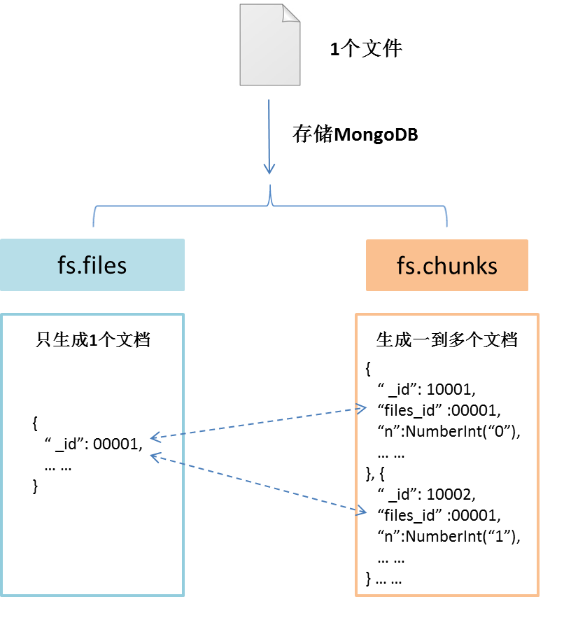
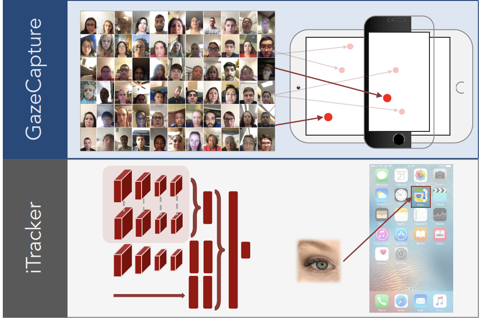
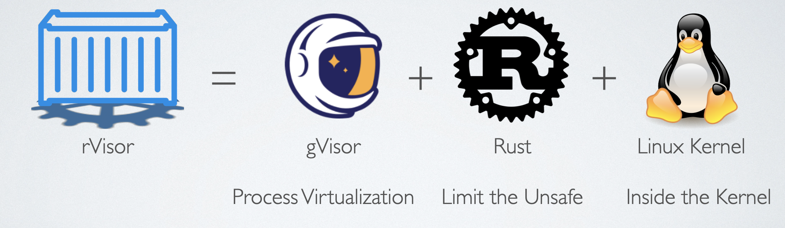
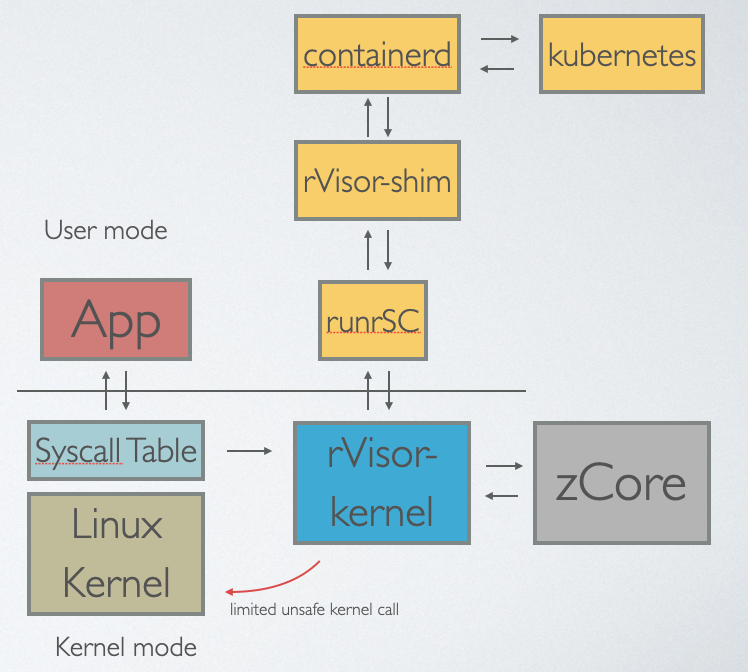
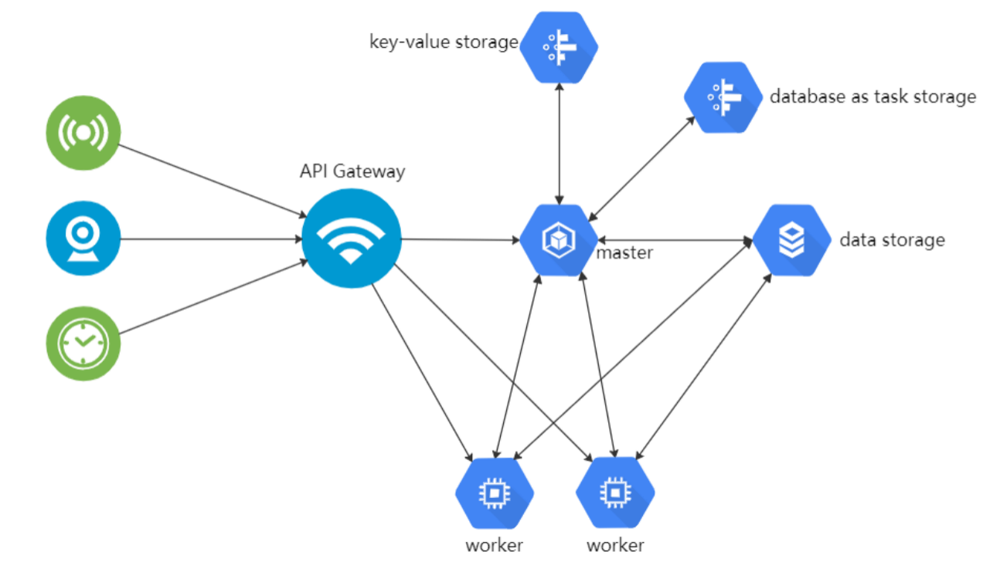

# 预调研
## 目录
- [往年项目简介](#往年项目简介)
  - [2018年](#2018年)
  - [2019年](#2019年)
  - [2020年](#2020年)
  - [2021年](#2021年)  2022-03-08 by 张子辰
- [感兴趣方向的初步调研](#感兴趣方向的初步调研)
  - [文件系统与数据库](#文件系统与数据库) 2022-03-09 by 陈建绿
    1. [2017 x-DFS](#1-2017-x-DFS)
    2. [2018 x-satu](#2-2018-x-satu)
    3. [2018 x-GBFS](#3-2018-x-GBFS)
    4. [2019 x-Erasure-Code-Improvement-based-on-ceph](#4-2019-x-Erasure-Code-Improvement-based-on-ceph)
    5. [2020 x-dontpanic](#5-2020-x-dontpanic)
    6. [2020 x-GDBFS](#6-2020-x-GDBFS)
    7. [2020 x-gkd](#7-2020-x-gkd)
    8. [2021 x-DisGraFS](#8-2021-x-DisGraFS)
    9. [2021 x-NBFS](#9-2021-x-NBFS)
    10. [MogoDB](#10-MongoDB)
    11. [GirdFS](#11-GirdFS)

- [初步构想](#初步构想)
  - [分布式文件系统1](#分布式文件系统1) 2022-03-08 by 张子辰 **【已被否决 2022-03-08 by 邢凯】**
  - [分布式文件系统2](#分布式文件系统2) 2022-03-09 by 张子辰 **【已被否决 2022-03-10 by 邢凯】**
  - [物联网操作系统](#物联网操作系统) 2022-03-12 by 陈建绿
  - [人机接口](#人机接口) 2022-03-12 by 吴骏东
  - [安全容器](#安全容器) 2022-03-12 by 蓝俊玮
  - [Unikernel](#Unikernel) 2022-03-12 by 张子辰
  - [树莓派上实现操作系统](#树莓派上实现操作系统) 2022-03-14 by 郭耸霄


## 往年项目简介

注：2018~2020年的项目参考了 [往届OSH课题调研报告.md](https://github.com/OSH-2021/x-DisGraFS/blob/main/docs/%E5%89%8D%E6%9C%9F%E8%B0%83%E7%A0%94%E5%86%85%E5%AE%B9/%E5%BE%80%E5%B1%8AOSH%E8%AF%BE%E9%A2%98%E8%B0%83%E7%A0%94%E6%8A%A5%E5%91%8A.md)。

### 2018年

#### X-wyj-1

- 小组成员：徐直前、吴永基、黄子昂、金朔苇 
- 项目简介：基于CRDT的多人实时协作编辑器
- 关键词：[CRDT](https://hal.inria.fr/hal-00932833/document), 实时文本协作, 所见即所得（针对Markdown和Latex)

#### X-Doudou

- 小组成员：何纪言、邓胜亮、缑慧星、赵敏帆、曾明亮
- 项目简介：Cunik 是一个面向开发人员和系统管理人员的平台，用于方便构建 Unikernel 应用、与其他必需内容一起打包、分发，从 CunikHub 轻松获取已构建好的镜像，快速部署和运行应用。
- 关键词 ：[Unikernel](http://unikernel.org/), [Cunik](https://github.com/Cunik/Cunik-engine), 云计算, 虚拟化
- 注：之后借鉴该课题的课题有：[x-orz](#（3）x-orz)。

#### X-yeahtiger

- 小组成员：隆晋威、吴昊、伊昕宇、魏天心
- 项目简介：该项目旨在为用户提供一个热部署的解决方案，让用户能在不对源码进行修改的情况下，使用本项目工具对程序进行热部署（即在不重启程序的情况下对程序进行更新）。
- 关键词：[热部署](https://baike.baidu.com/item/%E7%83%AD%E9%83%A8%E7%BD%B2)
- 注：该课题方向在历年中较为少见。

#### X-ccggw-2

- 小组成员：柴磊、顾健鑫、归舒睿、吴豫章、陈俊羽
- 项目简介：本项目基于 Linux 包管理工具链 dpkg 和 apt，在此之上建构了一个 P2P 的分布式网络，以获得更高速的下载和高度的可用性。每一个用户，都作为节点共享本机已经安装好的软件包，并也可以从其他用户处获得新软件包的下载和更新。
- 关键词：分布式网络, 包管理器
- 注：该课题涉及网络的知识较多，如选择该方向需先进行相关的知识储备。

#### X-oalad

- 小组成员：邓龙、戴路、吴紫薇、徐煜森、于颖奇 
- 项目简介：本项目旨在建立一个低成本的新方式，利用简单的头戴设备或者桌面设备（包括设备自带设备，如摄像头），对用户的视线信息做出分析，提取出有效信息作为机器输入，从而作为一种新的机器控制方法。具体地说，希望能从用户眼部信息中，实时的定位用户关注的屏幕区域、进行注视检测、提供辅助阅读等功能。
- 关键词：嵌入式, 可穿戴设备, 图像处理, 人机交互
- 注：该课题方向在历年中较为少见。

#### X-zos

- 小组成员：冉礼豪、胡煜霄、戈惊宇、任正行、管修贤
- 项目简介：通过设计 specialized monitor 进一步提高 unikernel 的性能，并改进 unikernel 调试方面的局限性。
- 关键词：[Unikernel](http://unikernel.org/), 云计算, 虚拟化

#### X-GBFS

- 小组成员：丁峰、⽜⽥、谢灵江、张⽴夫
- 项目简介：开发一种基于知识图谱的相关知识对计算机的个⼈⽂件数据进⾏表⽰的文件系统。这项⼯作主要的⽬的在于弥补传统⽂件系统⽆法表⽰的复杂语义关系的缺陷。即使⽤基于知识的⽂档表⽰⽅案，使得⼀篇⽂章不再只是由⼀组代表词汇的字符串表⽰，⽽是由⽂章的实体及其复杂语义关系表⽰。
- 关键词：GBFS 图文件系统, 语义分析
- 注：知识图谱，语义分析算比较新颖的想法。

### 2019年

[返回目录](#目录)

#### x-xdp-on-android

- 小组成员：龚平、王怡萱、魏剑宇、黄展翔、罗极羽
- 项目简介：该项目是将 XDP 移植至安卓平台，并进一步通过 XDP 在安卓上实现网络处理相关的应用。
- 关键词：[XDP](https://tonydeng.github.io/sdn-handbook/linux/XDP/), 移动操作系统, Android, 网络处理
- 注：涉及移动操作系统的课题较为少见，该课题可作为移动操作系统方向的参考。

#### x-rust-freetos

- 小组成员：樊金昊、左顺、宁雨亭、黄业琦、张俸铭、雷思琦
- 项目简介：使用 Rust 语言改写 FreeRTOS 操作系统
- 关键词：Rust, [实时操作系统FreeRTOS](https://freertos.org/)
- 注：改写某个操作系统的课题较为少见，该课题可作为相关方向的参考。

#### x-monthly-subscription

- 小组成员：赵家兴、陶柯宇、付佳伟、陈昂、李喆昊
- 项目简介：对计算机在网络包处理上进行非冯化改造，绕过 CPU 与操作系统内核，直接在网卡上对网络包进行数据流驱动的实时处理。目标是纳秒级的延迟。
- 关键词：网络, 高性能, 体系结构
- 注：该课题涉及网络的知识较多，如选择该方向需先进行相关的知识储备；试图改进计算机的体系结构也是可行的方向。

#### x-spider

- 小组成员：詹佑翊、曹宇昂、万琪、琚泽谦、张衎
- 项目简介：本项目旨在将[Rain](https://github.com/substantic/rain)（一个开源的Rust语言编写的分布式计算框架）从Linux系统移植到raspbian系统上，使树莓派成为分布式计算节点，能够接收、执行和返回服务器分发的计算任务；缩减和优化Rain代码，使其更加轻量、快速，并且能够长期在树莓派的后台运行，不影响其他运行在树莓派上的程序，以此实现对以树莓派为代表的物联网设备的闲置算力的有效利用。如果时间允许，还将尝试对Rain进行裸机编程的改造，提高Rain的运行速度，同时使Rain适用于更多物联网设备。
- 关键词：[Rain](https://github.com/substantic/rain), 分布式计算, 树莓派
- 注：该课题用上了树莓派，在以往课题中较为少见，可以作为相关方向的参考。

#### x-qwq

- 小组成员：彭定澜、陈墨涵、沈巍然、张德鑫、刘旭铠
- 项目简介：该项目是基于 Rust 改造的 seL4 微内核。L4 是一种微内核构架的操作系统内核。seL4 是 L4 微内核系列的一种，经 Haskell 形式化验证并实现为 C。该项目计划将它改写为 Rust，进一步提升安全性。
- 关键词：Rust, [seL4](https://sel4.systems/)
- 注：与Rust语言相关的课题在2019年的出现频率很高。

#### x-Erasure-Code-Improvement-based-on-ceph

- 小组成员：张灏文、陈云开、毕超、刘硕、张铭哲 
- 项目简介：在ceph的平台上对纠删码插件进行改进，使用柯西矩阵进行编码，使用 Intel 的 SIMD 指令集机型矩阵计算的加速，对于不同的数据进行分层的管理，达到更好的容错性和可用性。
- 关键词：分布式文件系统, [ceph](http://docs.ceph.org.cn/), erasure code

#### x-i-m-feeling-lucky

- 小组成员：刘云飞、李维晟、汪若辰、余磊
- 项目简介：使用 Rust 编程语言写一个能在树莓派上运行的操作系统。
- 关键词：Rust, 树莓派
- 注：重头开始写一个操作系统也算一个方向。

#### x-ridiculous-includeos

- 小组成员：刘紫檀、张博文、虞佳焕、汤兖霖
- 项目简介：在 ARM 架构上构建 IncludeOS 系统
- 关键词：[IncludeOS](https://www.includeos.org/), ARM

### 2020年

[返回目录](#目录)

#### x-dontpanic

- 小组成员：罗丽薇、邱子悦、袁一玮、余致远
- 项目简介：本项目旨在实现可用性高的基于互联网网页的小型分布式文件系统。在已有的项目的基础上，希望实现容器化服务器端、多用户权限支持、更高效的文件传输、减轻中央服务器负担、提高文件安全性和可用性等优化，做出可用性高的“私人网盘”。
- 关键词：互联网网页, 分布式文件系统, 容器化技术（[Docker](https://docs.docker.com/))
- 注：此项目为在[17级项目](#1.17级优秀课题)的基础上作出的改进。

#### GDBFS

- 小组成员：高楚晴、王幸美、王章瀚、万嘉诚、黄致远
- 项目简介：基于图数据库的着重人与文件系统交互的GDBFS（Graph Database File System）
- 关键词：图文件系统, 图数据库, 新型文件系统[DBFS](http://dbfs.sourceforge.net/)

#### x-orz

- 小组成员：夏寒、王原龙、张万林、李平赫
- 项目简介：本项⽬将一般网络程序中的任务拆分为常用的服务，不同服务集成到不同的Unikernel中。通过合理地编排调度Unikernel集群，将各种并发的服务组合起来，处理任务请求，从⽽而充分利利⽤用多核/多CPU资源，提高系统性能，同时⼜不破坏Unikernel原有的轻量、安全的特性。
- 关键词：[Unikernel](http://unikernel.org/), 云计算, 虚拟化, 高性能计算

#### x-gkd

- 小组成员：雷雨轩、裴启智、刘逸菲、曲阳、孙一鸣
- 项目简介：该项目通过高效、安全的Rust语言对17级项目“基于互联网网页的小型分布式文件系统”进行改写，并用极具计算效率和兼容性的WebAssembly来与JavaScript交互实现更高效的网页前端逻辑，并用WebAssembly把Rust写的分布式文件系统程序的包装，再通过Node.js部署Web服务器, 最终在Node.js(V8引擎)实现跨平台的，可提供移动式文件访问的分布式文件系统，并在性能、兼容性、创新性上取得突破。
- 关键词：Rust, 网页前端, 分布式文件系统
- 注：此项目为在[17级项目](#1.17级优秀课题)的基础上作出的改进。

#### x-chital

- 小组成员：丁垣天、叶之帆、何灏迪、郑在一
- 项目简介：参考 gVisor(一种轻量级的容器技术) 的实现，利用系统调用劫持的方法，实现进程级的虚拟化。在gVisor的基础上，避免 go 语言运行时的开销，为程序提供轻量高效的运行环境。
- 关键词：[gVisor](https://gvisor.dev/), 虚拟化

### 2021年

[返回目录](#目录)

#### x-DisGraFS

- 小组成员：彭怡腾、彭浩然、黄晋超、朱一鸣、袁玉润
- 项目简介：构建分布式图文件系统（DisGraFS, Distributed Graph Filesystem），在分布式机群的规模上，图文件系统能够实现所管理的信息规模的扩大与各类资源的均衡分配，从而在超出人类记忆能力的信息规模上体现出图文件系统相对于传统树形结构的优越性。通过主机（Master）对从机（Slave）的存储空间以及算力的合理调度以及在主机的指导下用户与从机之间的直接对接，我们的项目期望实现一个高效的、用户友好的、高可扩展性的分布式图文件系统，以进一步拓展图文件系统在未来应用中的可能性。
- 关键词：分布式文件系统, 图文件系统
- 注：该项目借鉴了GDBFS和x-gkd，并且创造性地将图文件系统和分布式文件系统结合。

#### x-seLVM

- 小组成员：张一方、陶思成、吴晨源、林晨阳

- 项目简介：x-seLVM项目旨在利用Lua虚拟机，使seL4内核对平台的依赖转化为Lua虚拟机对平台的依赖，从而扩大seL4微内核的平台适用范围。主要的技术为将内核的部分接口进行改写，并将其注册到Lua程序中，实现运行在Lua虚拟机上的seL4内核。

- 关键词：Lua语言, 虚拟化, [seL4](https://sel4.systems/)

#### x-unipanic

- 小组成员：高泽豫、谢强、蔡智臻、徐怡

- 项目简介：云计算场景下，Unikernel具有轻量、安全、快速的优势，但它被一些不足限制了应用范围。 本项目旨在通过提升Unikernel的二进制兼容性，来扩大它的应用范围。 我们主要参照了已有的Hermitux项目，在此基础上做出了两点改进：
  1. 增加了支持fork()系统调用，从而使Unikernel支持多进/线程；
  2. Hermitux项目改写了系统调用以减少上下文切换，提高速度；我们组修改了改写系统调用的逻辑，从而能改写更多的系统调用，进一步提高速度。
- 关键词：UniKernel, 进程调度

#### x-RIG

- 小组成员：胡冰、李清伟、陈文杰、张栋澈、徐昊
- 项目简介：基于rust-freertos的版本更迭和改进，尝试使rust-freertos能够更好地用于生产生活中。融入一部分sel-4的安全特性到freertos，以期望增强其安全性。
- 关键词：rust, FreeRTOS, seL4
- 注：直接改进往年的项目也是可以接受的。

#### x-KATA-Unikernel

- 小组成员：钟书锐、李思逸、赵辰阳、谢新格、胡乐翔
- 项目简介：利用unikernel得天独厚的轻量和攻击面小的特性，结合虚拟化技术，为FaaS（Function As A Service）场景下的云服务提出一种解决方案：从客户端提交代码，到云平台进行Serverless运算。采用KVM 的虚拟机接口，在虚拟化环境中以unikernel减少资源开销，达到空间的高效利用和速度的极限提升。
- 关键词：UniKernel, 虚拟化, 云计算

#### x-NBFS

- 小组成员：陈耀祺、黄科鑫、梁峻滔、郑师程
- 项目简介：设计和实现一个针对改进Nvme SSD读写性能的文件系统，并基于SPDK工具实现了该文件系统，同时提供了两套用于访问底层设备的接口，一套是用于FUSE挂载的通用接口，另一套是用于专用应用的专用接口。
- 关键词：文件系统, 固态硬盘
- 注：为特定硬件设计文件系统的课程项目非常少见，本项目可以作为该方向的参考。

#### x-sBPF

- 小组成员：陈思睿、梁恒宇、吕泓涛、汤力宇
- 本组的项目是一个轻量级的文件系统沙盒，通过劫持文件访问相关的系统调用，实现对文件的保护。项目的特色在于本项目的沙盒程序是一段动态植入内核空间的kernel代码，可以最小化反复切换特权级别带来的性能损失，并且保留了用户态程序级别的自由度和灵活性。本项目目前已经在同一个框架下实现了三种不同的文件保护模式，可以灵活地为使用者选择，满足不同类型的数据保护需要。本项目还通过引入cgroup，实现了进程资源分配的限制，提高了对系统的整体保护。
- 关键词：虚拟化, 容器, 文件保护, 系统安全
- 注：该项目的报告使用LaTeX排版，在撰写报告时可以参考。

## 感兴趣方向的初步调研

### 文件系统与数据库

#### 1. 2017 x-DFS

[返回目录](#目录)

[基于互联网网页的小型分布式文件系统](https://github.com/IngramWang/DFS_OSH2017_USTC)。该项目设计了一个新型的家用的分布式文件系统，可以利用所有安装了项目客户端的机器共享存储空间存储文件碎片，利用一个专用的服务器维持系统的状态并协调各个客户机处理请求，利用互联网网页访问整个文件系统。

文件系统的数据备份机制为纠删码。

该项目的详细设计报告中指出：“除了备份机制，为了进一步提高文件的可用性”，他们期待“把目前已经十分成熟的网盘资源整合进本项目设计的分布式文件系统，这种实现方式在目前常见的分布式文件系统中尚未出现”。

他们的分布式文件系统的模块组成说明：

| 客户端程序         | 服务器程序   | web 服务程序组       |
| ------------------ | ------------ | -------------------- |
| 启动与异常处理模块 | 启动模块     | Tomcat 服务程序      |
| 文件分块模块       | 控制连接模块 | 登录注册模块         |
| 服务器连接模块     | 数据连接模块 | 网页主界面           |
| 文件夹监控模块     | 数据块模块   | 文件目录展示交互模块 |
|                    |              | 文件下载模块         |

> **相关资料**：
>
> 纠删码讲解参考文章：[纠删码Erasure Coding——简书博客](https://www.jianshu.com/p/acf0f392bac9?utm_campaign=studygolang.com&utm_medium=studygolang.com&utm_source=studygolang.com)。

#### 2. 2018 x-satu

[返回目录](#目录)

[面向物联网的文件系统](https://github.com/OSH-2018/X-satu)。主要功能为将不同类型的网络连接持久化存储在文件中，从而在网络数据高效传输的同时，可以做到近乎实时的缓冲和备份，并且对用户提供一个一致且易用的接口。实现可靠、实时、可伸缩、可扩展、资源消耗低、面向流数据优化且能与网络集成的嵌入式文件系统，适用于资源有限的无线传感器网络的数据采集工作。

#### 3. 2018 x-GBFS

[返回目录](#目录)

 [一种基于知识图谱的相关知识对计算机的个⼈⽂件数据进⾏表⽰的文件系统](https://github.com/OSH-2018/X-GBFS)。在这种表示下，用户可以对文件进行加、减标签的操作，可以实现根据标签查找文件的操作，可以实现文件的推荐功能来获取相关文件信息，这些操作在一定程度上可以优化用户的文件系统使用体验。

> **相关资料**：
>
> FUSE介绍: [FUSE——维基百科](https://zh.wikipedia.org/wiki/FUSE)
>
> FUSE讲解: [FUSE文件系统——CSDN博客](https://blog.csdn.net/feelabclihu/article/details/109396707)
>
> Neo4j参考资料：[Neo4j详解——CSDN博客](https://blog.csdn.net/Dream_bin/article/details/104470275)
>
> CN-DBpedia介绍及使用说明: [CN-DBpedia——Github`Languageresources`项目介绍](https://languageresources.github.io/2018/04/19/%E6%9D%8E%E5%8D%8E%E5%8B%87_CN-DBpedia/)
>
> Socket通信讲解：[超详细的Socket通信原理和实例讲解——网络博客](https://network.51cto.com/article/608725.html)

#### 4. 2019 x-Erasure-Code-Improvement-based-on-ceph

[返回目录](#目录)

[在ceph的平台上对纠删码插件进行改进](https://github.com/OSH-2019/x-Erasure-Code-Improvement-based-on-ceph)。该项目将纠删码插件改进为使用柯西矩阵进行编码，使用 Intel 的 SIMD 指令集机型矩阵计算的加速，对于不同的数据进行分层的管理，达到更好的容错性和可用性。

> **相关资料**：
>
> 纠删码讲解参考文章：[纠删码Erasure Coding——简书博客](https://www.jianshu.com/p/acf0f392bac9?utm_campaign=studygolang.com&utm_medium=studygolang.com&utm_source=studygolang.com)
>
> Ceph介绍：[Ceph(软件)——维基百科](https://en.wikipedia.org/wiki/Ceph_(software))
>
> Ceph讲解：[分布式存储Ceph讲解——博客园博客](https://www.cnblogs.com/zhou2019/p/10750648.html)

#### 5. 2020 x-dontpanic

[返回目录](#目录)

[可用性高的基于互联网网页的小型分布式文件系统](https://github.com/OSH-2020/x-dontpanic)。该项目是2017年项目x-DFS的优化设计，优化实现了容器化服务器端、多用户权限支持、更高效的文件传输、减轻中央服务器负担、提高文件安全性和可用性。本项目的介绍指出，2017年的项目x-DFS的数据传输是中心化的，所有文件都要经过中央服务器的中转，有一些不利之处。

该项目在设计上体现出了和NAS、IPFS的互补性以及独有的优势:

|            |                IPFS                |                    Their FS                    |
| :--------: | :--------------------------------: | :--------------------------------------------: |
| 数据安全性 | 无身份验证，拿到哈希值就能拿到文件 | 目录节点可进行身份验证，用户只能访问自己的文件 |
| 数据可靠性 |         无法保证足够可用源         |      目录节点可协调冗余备份，保证备份充足      |

IPFS 在去中心化上做了充分工作，但同时因为完全去除了中心化的元素，它仍有需要解决的问题：

- 存储数据的安全性：缺少验证用户身份的过程，任何人只要拿到文件的哈希值就能获取文件内容。
- 数据可靠性：IPFS 系统虽然有激励层，但是无法保证一份数据能够有**足够的备份**在系统中存储，从而有可能导致数据丢失。

而该项目在设计上**选择保留目录节点**，避免了上述两大问题，且具有 IPFS 的存储节点去中心化的优势。

|          |              NAS               |              Their FS              |
| :------: | :----------------------------: | :--------------------------------: |
| 设备限制 |            专有设备            | 普通设备运行客户端即可，跨平台兼容 |
| 扩容限制 | 单台扩容有限，多台难以无缝合并 |              无缝扩展              |

NAS 的局限性在于它的系统使用专有设备，前期安装和设备成本较高。同时它在可扩展性上亦面临一定的限制，因为单台 NAS 的扩容是有限的，增加另一台 NAS 设备非常容易，但是不易将两台 NAS 设备的存储空间**无缝合并**。

而在该项目中，存储节点只需持续运行项目的 Java 跨平台程序，不必使用专有设备，并且项目在可扩展性上不存在 NAS 面临的问题。

>  **IPFS**
>
>  IPFS 全称 Interplanetary File System，意为星际文件系统。它创建了分布式存储和共享文件的网络传输协议，意在将所有具有相同文件系统的计算设备连接在一起。IPFS 有如下特性：
>
>  1. 使用区块链技术，使 IPFS 实现了文件存储的持久性，相比中心化的服务更难被篡改和封禁。
>  2. IPFS 在文件传输上采取 P2P 模式， 充分地利用了个节点之间的带宽资源，并且无需一个强大的中央服务器来满足大量服务，达到了高效和低成本。
>  3. 每一个上传到 IPFS 的文件会被分配一个内容的哈希作为地址，访问只需验证哈希。
>  4. Filecoin 是 IPFS上的一个代币，用来激励用户贡献闲置的硬盘。它通过算法确定工作量发放。简单来说，拥有的硬盘容量越大，获取的 Filecoin 越多。
>
>  **NAS**
>
>  NAS 全称 Network Attached Storage，是一种可以通过网络访问的专用数据存储服务器，它可以将分布、独立的数据进行整合，集中化管理，以便于对不同主机和应用服务器进行访问的技术。

> **相关资料**：
>
> IPFS讲解：[认识IPFS——阿里云开发者社区博客](https://developer.aliyun.com/article/726565)
>
> IPFS使用教程：[IPFS 使用入门](https://segmentfault.com/a/1190000017545827)
>
> NAS讲解：[NAS详解](https://zhuanlan.zhihu.com/p/52471966)

#### 6. 2020 x-GDBFS

[返回目录](#目录)

[基于图数据库的着重人与文件系统交互的文件系统](https://github.com/OSH-2020/GDBFS)。该项目有些像2018年项目x-GBFS项目的优化重写。该项目使用Django实现Web前端，界面更加美观，2018年的x-GBFS项目则实现的是命令行操作。二者都使用了Neo4j搭建图数据库。

该项目的Web操作界面：


> **相关资料**：
>
> Neo4j参考资料：[Neo4j详解——CSDN博客](https://blog.csdn.net/Dream_bin/article/details/104470275)
>
> Django教程：[Django 教程——菜鸟教程](https://www.runoob.com/django/django-tutorial.html)

#### 7. 2020 x-gkd

[返回目录](#目录)

[基于 Rust 和 WebAssembly 的分布式文件系统](https://github.com/OSH-2020/x-gkd/blob/master/docs/conclusion.md)。本项目是2017年项目x-DFS的改写，使用Rust语言对client端和server端完全改写，重用原项目的web前端。该项目名称中提到的`WebAssembly`并没有在项目中使用，其最终的报告中指出WebAssembly有诸多限制，Rust不能与WebAssembly共同工作。

> **相关资料**：
>
> WebAssembly介绍：[WebAssembly简介](https://zhuanlan.zhihu.com/p/42718990)

#### 8. 2021 x-DisGraFS

[返回目录](#目录)

[分布式图文件系统](https://github.com/OSH-2021/x-DisGraFS)。该项目可看作是2018年项目x-GBFS、2020年项目x-GDBFS的优化设计，他们提出了分布式图文件系统的概念，**统一了单机图文件系统和分布式文件系统的优点**。将图结构与思想应用于分布式文件系统上面，使得分布式图文件系统兼具图文件系统方便用户快速搜索，模糊搜索，查找相关文件的特点以及分布式文件系统的海量文件存储，云存储的特点。

该项目在建立图数据结构时，考虑到多用户操作文件系统联想到的关键词会有可能不同，从而提出使用用机器对文件打标的想法，让不了解其他用户命名习惯的用户也能在自己并不熟悉的大规模文件系统下快速检索到自己想要的文件。

此外，分布式图文件系统中，文件、数据库的维护任务以及关键词提取的任务可以不再集中于一台机器，而是分配到不同的设备上完成。主、从机分工合作，实现算力、存储和网络资源的合理分配，最大化地利用资源。

> **相关资料**：
>
> Neo4j参考资料：[Neo4j详解——CSDN博客](https://blog.csdn.net/Dream_bin/article/details/104470275)
>
> Ray讲解：[Ray 分布式计算框架详解](https://xie.infoq.cn/article/1bf9d6404f2c1536102c8d45a)
>
> JuiceFS介绍：[JuiceFS 是什么？——JuiceFS官网](https://juicefs.com/docs/zh/cloud/intro/)
>
> JuiceFS教程：[JuiceFS 云服务快速上手指南——JuiceFS官网](https://juicefs.com/docs/zh/cloud/getting_started/)
>
> JuiceFS讲解：[JuiceFS框架介绍和读写流程解析——博客园](https://www.cnblogs.com/luohaixian/p/15374849.html)

#### 9. 2021 x-NBFS

[返回目录](#目录)

 [针对改进 NVMe SSD 读写性能的文件系统](https://github.com/OSH-2021/x-NBFS)。该项目在改进 NVMe SSD 性能的同时，基于 SPDK 工具实现该文件系统，同时提供了两套用于访问底层设备的接口，一套是用于`FUSE`挂载的通用接口，另一套是用于专用应用的专用接口。

两套接口的特点如下：

- 通用接口：以通用性为第一目标，可对接`SPDK`提供的`FUSE`插件，进而可被正常软件调用，在此基础上，利用`SPDK`的特性提高其性能。
- 专用接口：以性能提升为第一目标，直接利用`SPDK`平台搭建一套异步、无锁、并发的文件系统，实现我们所设想的性能提升。

> **相关资料**：
>
> NVMe介绍：[NVMe SSD是什么？——网络博客](https://blog.51cto.com/alanwu/1766945)
>
> FUSE讲解: [FUSE文件系统——CSDN博客](https://blog.csdn.net/feelabclihu/article/details/109396707)
>
> SPDK讲解：[SPDK详解——CSDN博客](https://blog.csdn.net/weixin_40343504/article/details/88706733)

#### 10. MongoDB

[返回目录](#目录)

> MongoDB 是一个基于分布式文件存储的数据库。由 C++ 语言编写。旨在为 WEB 应用提供可扩展的高性能数据存储解决方案。
>
> MongoDB 是一个介于关系数据库和非关系数据库之间的产品，是非关系数据库当中功能最丰富，最像关系数据库的。

#### 11. GirdFS

[返回目录](#目录)

GridFS 是 MongoDB 的一个子模块,使用 GridFS 可以基于 MongoDB 来持久存储文件，并且支持分布式应用(文件分布存储和读取)。

MongoDB文档：[GridFS — MongoDB Manual](https://docs.mongodb.com/manual/core/gridfs/)

##### 简要介绍

用于处理大小超过16M的文件，将其切割成指定大小（默认为255KB）的文档块进行存储；

读取时根据需要对其拼接，不会加载所有内容；

用两个集合进行存储，`fs.files`存储文档相关信息（如文档名称、大小、块大小等），`fs.chunks`存储各文档分块（文档的实际内容）。

##### 实现细节

​		当把一个文件存储到 GridFS 时，如果文件大于 `chunksize` ，会先将文件按照 `chunk` 的大小分割成多个 `chunk` 块，最终将 `chunk` 块的信息存储在 `fs.chunks` 集合的多个文档中。然后将文件信息存储在 `fs.files` 集合的唯一一份文档中。其中 `fs.chunks` 集合中多个文档中的 `file_id` 字段对应 `fs.files` 集中文档`_id`字段。

​		读文件时，先根据查询条件在 `files` 集合中找到对应的文档，同时得到`_id`字段，再根据`_id`在 `chunks `集合中查询所有`files_id`等于`_id`的文档。最后根据`n`字段顺序读取 `chunk` 的`data`字段数据，还原文件。

如下图所示：



fs.files 内容为

```c++
{
 "_id": <ObjectId>,  			// 文档 ID，唯一标识
 "chunkSize": <num>, 		 	// chunk 大小 256kb
 "uploadDate": <timetamp>, 		//文件上传时间 
 "length": <num>,   			// 文件长度
 "md5": <string>,   			// 文件 md5 值
 "filename": <string>, 			// 文件名
 "contentType": <string>,		// 文件的?MIME类型
 "metadata": <dataObject>		// 文件自定义信息
}
```

fs.chunks 内容为

```c++
{
 "_id": <ObjectId>,  // 文档 ID，唯一标识
 "files_id": <ObjectId>,  // 对应 fs.files 文档的 ID
 "n": <num>,      // 序号，标识文件的第几个 chunk
 "data": <binary>   // 文件二级制数据
}
```

##### 相关评价

基于MongoDB，易用易扩展。后者系统老练且成熟稳定；

对于大量大文件的处理效率较高；

不建议用于大量小文件的存储管理；

##### 较大缺陷

无法直接修改文档。如果要修改GridFS里面的文档，只能是先删除再添加 。

##### 参考资料

菜鸟简明版：[MongoDB GridFS | 菜鸟教程 (runoob.com)](https://www.runoob.com/mongodb/mongodb-gridfs.html)

## 初步构想

### 分布式文件系统1

【已被否决】[返回目录](#目录)

去中心化、支持写时复制的分布式文件系统。

#### 特征

1. 使用区块链技术实现完全的去中心化。
2. 将文件切割成大小为1MiB（待定）的数据块。
3. 以数据块自身的SHA-256为密钥，用AES-256算法加密数据块。在**储存区**保存加密后的数据块和加密后的数据块的SHA-256，在**使用区**保存原始数据块的SHA-256和加密后的数据块的SHA-256。
   注：由于是去中心化，这里避免了使用“服务端”和“客户端”。储存区可以位于任何设备上，而使用区保存在本地。
4. 利用写时复制和隐式共享技术，不过度重复储存内容相同的数据块，但是会进行适当的冗余备份。
5. 为数据块保存引用计数，引用计数达到0的数据块将被从储存区移除。

#### 待定内容

1. 缓存。
2. 针对小文件优化。
3. 在远程保存加密后的文件表。

#### 难点

1. 在去中心化前提下，高效获取文件的储存位置。（其实去中心化网络本身就是一个难点。）
2. 垃圾清理，即删去过时的数据块。

#### 参考

[返回目录](#目录)

一名组员的个人计算机上的文件的大小分布（见[allfile_size-sorted](https://github.com/gsxgoldenlegendary/x-LJW/tree/master/references/allfile_size-sorted)）：

| 大小范围 $(-\infty,x]$ (byte) | 频率     |
| ----------------------------- | -------- |
| 0                             | 11.593%  |
| 16                            | 11.908%  |
| 32                            | 15.196%  |
| 64                            | 17.008%  |
| 128                           | 18.635%  |
| 256                           | 22.253%  |
| 512                           | 27.781%  |
| 1024 (1KiB)                   | 36.651%  |
| 2048                          | 51.502%  |
| 4096                          | 63.651%  |
| 8192                          | 72.140%  |
| 16384                         | 79.910%  |
| 32768                         | 85.931%  |
| 65536                         | 90.163%  |
| 131072                        | 92.981%  |
| 262144                        | 94.804%  |
| 524288                        | 96.352%  |
| 1048576 (1MiB)                | 97.341%  |
| 2097152                       | 98.072%  |
| 4194304                       | 99.042%  |
| 8388608                       | 99.724%  |
| 16777216                      | 99.880%  |
| 33554432                      | 99.935%  |
| 67108864                      | 99.963%  |
| 134217728                     | 99.983%  |
| 268435456                     | 99.992%  |
| 536870912                     | 99.995%  |
| 1073741824 (1GiB)             | 99.997%  |
| 2147483648                    | 99.998%  |
| 4294967296                    | 99.999%  |
| 8589934592                    | 100.000% |

```c++
//find / -type f -printf "%s\n" > allfile_size
#include <fstream>
#include <map>
#include <iomanip>
using namespace std;

int main()
{
    map <size_t,size_t> sizes;
    ifstream fin("allfile_size");
    size_t cnt=0;
    while(fin)
    {
        size_t tmp;
        fin>>tmp;
        ++sizes[tmp];
        ++cnt;
    }
    double r_cnt=100.0/cnt1;
    fin.close();
    ofstream fout("allfile_size-sorted");
    size_t prefix_cnt=0;
    fout<<setprecision(3)<<fixed;
    for(auto &i:sizes)
        fout<<setw(15)<<i.first<<setw(10)<<i.second<<setw(10)<<(prefix_cnt+=i.second)*r_cnt<<"%\n";
}
```


### 分布式文件系统2

【已被否决】[返回目录](#目录)

速度不会明显慢于机械硬盘的对用户透明的分布式文件系统。

当前的计算机的储存设备的层次为，寄存器—缓存—内存—硬盘（可以细分为固态硬盘和机械硬盘，但是在实际应用中，两者处在同一个层次，固态硬盘常常被作为最终的储存介质，而不是被用来加速机械硬盘的访问），而专用的储存服务器可以提供比硬盘空间更大、成本更低、更持久但访问更慢的储存，因此专用的存储服务器有可能成为计算机存储系统的一个层次。

#### 特征

1. 能够借助FUSE挂载，近似POSIX兼容（不兼容之处会在下面列出）。现在的[GlusterFS](https://docs.gluster.org/en/latest/)、[IPFS](https://docs.ipfs.io/)等都支持这一特性。
2. 提供专用的API，以支持更多特有操作。
3. 利用访问局部性建立文件缓存，以使绝大部分IO操作的性能达到硬盘的速度和响应时间。
   观察：
   - 用户倾向于在短时间内频繁地访问某个目录下的文件，比如应用程序执行时会频繁地在应用程序的目录下读取资源文件，人在开发项目时会频繁修改项目目录下的文件。
   - 用户倾向频繁地修改一个文件，比如写实验报告时反复保存。
4. 在服务端维护文件的普及率。对于长度大于`WORTH_SHARING_LIMIT`且权限不是`??0`的文件，将拥有人数超过`COMMON_FILE_LIMIT`的文件认定为普遍文件，将拥有人数超过`POPULAR_FILE_LIMIT`的文件认定为流行文件。其他文件一律视为私有文件（或者是不值得共享的文件）。
5. 将私有文件按读、写频率分为冷文件（读写频率都很低）、静态热文件（写频率低、读频率高）、动态热文件（读写频率都很高）。
6. 普遍文件和流行文件使用自身的散列（本来想用SHA-256，但处于一些考虑决定使用修改过的SHA-2）为key加密（持有散列即可获取文件，方便分享，并降低储存开销）。私有文件使用用户自定义的key加密。
7. 普遍文件和私有文件在专用的储存服务器上储存，流行文件在去中心化网络中储存（可参考[IPFS](https://docs.ipfs.io/)）。（兼顾可用性和存取效率）
8. 冷文件、静态热文件、普遍文件用Reed–Solomon纠错码容错（可以参考2019年的x-Erasure-Code-Improvement-based-on-ceph）。动态热文件和流行文件使用多副本容错（前者占比极小，而且修改频率高，计算纠错码代价过大；后者使用去中心化网络存储，天然具有重复储存的特性）。
9. 以`.\\`开头的目录名被保留（虽然POSIX命名空间允许文件名中出现`\`，但这仍然非常罕见，而两个连续的`\`出现的频率就更低了，所以保留它们不会影响用户体验）。
   - `.\\unsorted`是未整理文件目录，被放到这个目录下的文件会被自动添加内容标签（本地计算标签，远程计算侵犯个人隐私），这能帮助用户可以快速找到这些文件（这借鉴了2020年的GDBFS和2021年的x-DisGraFS的提取文件的内容属性）。
   - `.\\old-<文件名>`是文件的历史版本，只对动态热文件和刚刚发生修改的文件维护，防止用户误修改。
   - `.\\deleted`是最近被删除的文件，以减少误用`rm`带来是损失（`.\\deleted`比传统的`.Trash`更底层）。
10. 未被放入`\\\unsorted`的非私有文件也会被添加内容标签。私有文件不会被自动加标签，因为这会让用户感到自己被计算机支配。
11. 被自动生成的标签可以被手动修改。
12. 建立文件名索引和文件标签索引，用户可以通过这些索引快速搜索到自己像要的文件。

### 物联网操作系统

[返回目录](#目录)

#### 往届 IoT OS 相关项目调研

目前，物联网操作系统主要分为两大类，一是由传统的嵌入式实时操作系统(RTOS)发展而来，比如FreeRTOS、LiteOS、RT-Thread；二是由互联网公司的云平台延伸而来，基于传统操作系统进行“剪裁”和定制的IoT OS，比如Ali OS Things、TencentOS tiny、Win10 IOT。往届IoT OS相关项目主要关注的是前者，还没有人关注后者。

下面是对往届两个 IoT OS 相关项目相关工作的调研。

##### 2019 x-rust-freertos

[该项目](https://github.com/OSH-2019/x-rust-freertos)是利用Rust语言改写FreeRTOS操作系统。在该项目中，小组成员按照FreeRTOS的程序逻辑，针对Rust语言的特点做出了一些富有创造力的设计。最终该项目完成了6000多行代码，几乎实现了FreeRTOS的所有功能，在使用Rust改写的过程中，该小组遇到了很多Rust语言特性带来的困难，比如Rust不鼓励使用全局变量，他们在消灭全局变量的过程中遇到了很多麻烦；还有改写C语言的指针时遇到的麻烦，他们的代码中使用了过多智能指针，这就导致这些指针基于操作系统的信号量机制，容易造成死锁。

总的来看，该项目需要：

- 前期花费精力学习Rust这门大家接触较少的语言；
- 阅读已有的操作系统的源代码，弄明白该系统各层面的实现机制；
- 使用新学习的语言重写已有的操作系统，并在发现原实现机制无法复现时，找出相应的改写方案。

##### 2021 x-RIG

[该项目](https://github.com/OSH-2021/x-RIG)以 `FreeRTOS` 为依据，主要完成以下3项内容：

1. 进行FreeRTOS的Rust版本迭代(在2019年的x-rust-freertos的基础上迭代)；

2. 将seL4的 `capability` 机制添加到 FreeRTOS 中；

3. 通过可加载模块实现FreeRTOS在多核处理器（如树莓派）上运行。

第一项工作的依据：19年项目改写的FreeRTOS的版本是9.0版，该版本发行于2016年，而x-RIG项目组创建项目时，FreeRTOS已经更新到10.4版，所以该组对19年项目进行更新迭代，添加stream buffer模块；

第二项工作的依据：FreeRTOS并没有安全模型，而该操作系统在物联网中应用十分广泛，再加之嵌入式设备逐步连入网络的趋势，安全性问题亟待解决，因此该小组便考虑为FreeRTOS引入一个基于 seL4's capability 的 security model，提高FreeRTOS面对威胁时的防御力，保证其安全性；

第三项工作的依据：早期的嵌入式处理器运算能力低，而随着大规模集成电路技术的发展和摩尔定律的驱使，嵌入式处理器的性能越来越强，从而嵌入式应用也日趋复杂，反过来对嵌入式处理器性能的要求也越来越高。该小组在多核架构上实现FreeRTOS，意在满足对嵌入式系统不断增长的需求。

总的来看，该项目需要：

- 前期花费精力学习Rust这门大家接触较少的语言；
- 学习FreeRTOS的框架并掌握版本更新的内容，从而对Rust版FreeRTOS要更新实现的内容有所了解；
- 学习seL4框架，对seL4的capability机制进行学习，并将其移植到FreeRTOS中。

##### 往届 IoT OS 相关项目调研小结

往届物联网操作系统相关项目只有两个，而这两个又都与FreeRTOS相关，和分布式文件系统以及 Unikernel 这两个方向相比，这个方向算是冷门方向。

第一个项目x-rust-freertos算是开创性的一个项目，使用更加安全的Rust语言对已有的物联网操作系统进行改写，提升其安全性。毕竟已经有了 FreeRTOS 的源码架构，该项目在真正掌握Rust后实现起来并不是一件十分困难的事情，而难点就在于大家对Rust接触不多，需要从头学习，还要求即学即用，这也是一件十分富有挑战性的事情。

第二个项目则是在前一个项目的基础上进行了版本迭代，添加了新模块的Rust实现，毕竟已经有了前人的改写经历，因此单就版本迭代这一任务，难度并不大，只是也需要大家对Rust语言进行学习，但好在已经有前人的Rust改写代码，学习成本也会相应降低；此外该项目还考虑到FreeRTOS的安全性问题，创造性地将其他微内核中的安全机制引入到FreeRTOS中去，这种创造性思维很难得。

#### IoT OS 项目构想

##### 构想依据

###### TencentOS Tiny

TencentOS Tiny 是腾讯面向物联网领域开发的实时操作系统，具有低功耗，低资源占用，模块化，安全可靠等特点，可有效提升物联网终端产品开发效率。目前该操作系统已经在[github开源](https://github.com/OpenAtomFoundation/TencentOS-tiny)，且官方团队在github上提供了许多[相关学习资料](https://github.com/OpenAtomFoundation/TencentOS-tiny#%E4%B9%9D%E7%AC%AC%E4%B8%89%E6%96%B9%E5%BC%80%E5%8F%91%E8%80%85%E8%AF%84%E6%B5%8B)，比较方便学习。

> TencentOS tiny 提供精简的 RTOS 内核，内核组件可裁剪可配置，可快速移植到多种主流 MCU (如 STM32 全系列)及模组芯片上。而且，基于 RTOS 内核提供了丰富的物联网组件，内部集成主流物联网协议栈（如CoAP/MQTT/TLS/DTLS/LoRaWAN/NB-IoT等），可助力物联网终端设备及业务快速接入腾讯云物联网平台。

###### MS-RTOS

MS-RTOS (Micro Safe RTOS) 是翼辉信息全新设计的一款面向未来的安全实时操作系统，其最大的特点是**开创性地在没有 MMU 和资源受限的 MCU**（如Cortex-M3）**上也能支持多进程与动态装载技术**，使得应用与系统能分离开发、独立升级；MS-RTOS **支持内核空间内存保护**（应用程序通过 syscall 访问内核），使得内核有着非常高的安全性。MS-RTOS 在提供足够丰富功能的同时，保持了高效简洁的实现，对 ROM、RAM 消耗极低，特别适用于对硬件成本敏感、安全性要求特别高的产品。

>**多进程**：
>允许运行多个进程，进程用户代码工作在 CPU 用户态，通过系统调用（syscall）访问内核资源，利用 MPU 实现进程地址空间相互隔离。
>
>**动态装载**：
>驱动与应用程序分离开发，应用与系统独立升级，应用程序直接在 FLASH 中运行（无需加载到 RAM 执行，节约 RAM，运行速度更快）。
>
>**内核安全**：
>进程用户代码工作在 CPU 用户态，通过系统调用（syscall）进入内核, 保护内核不被进程破坏，利用 MPU 做到进程地址空间相互隔离, 进程影响范围最小化，掉电安全文件系统。

目前该操作系统只是对部分中间件在[github](https://github.com/ms-rtos)和[gitee](https://gitee.com/ms-rtos)上开源，并没有全部开源。

##### 构想内容

能否将MS-RTOS的鲜明特点移植到TencentOS Tiny中去，从而将二者的优点合并，得到一个更加优越的物联网操作系统呢？与此同时，能不能优化MS-RTOS的安全机制使得新的物联网操作系统在当今时代变得更加安全呢？这两个项目都是用C语言实现的，如果有必要，能不能使用Rust对其进行改写从而得到更加安全的代码呢？

以上便是我的一些初步构想内容。

#### IoT OS 相关参考资料

- [Open Source RTOS List](https://www.osrtos.com/)
- [TencentOS Tiny——Github](https://github.com/OpenAtomFoundation/TencentOS-tiny)
- [MS-RTOS——Github](https://github.com/ms-rtos)
- [MS-RTOS——Gitee](https://gitee.com/ms-rtos)
- [主流物联网操作系统介绍——电子工程专辑](https://www.eet-china.com/news/202105180818.html)

- [MS-RTOS正式发布啦！！！——CSDN博客](https://blog.csdn.net/ScilogyHunter/article/details/107390947)

- [什么是实时操作系统(RTOS)——知乎专栏](https://zhuanlan.zhihu.com/p/86861756)
- [何小庆的presentations主页](https://www.hexiaoqing.net/presentations/)
  - [物联网操作系统研究与思考(2017.6)](https://www.hexiaoqing.net/wp-content/uploads/2016/05/%E7%89%A9%E8%81%94%E7%BD%91%E6%93%8D%E4%BD%9C%E7%B3%BB%E7%BB%9F%E7%A0%94%E7%A9%B6%E4%B8%8E%E6%80%9D%E8%80%83-201706.pdf)
  - [物联网操作系统:技术、应用与发展(2018.4)](https://www.hexiaoqing.net/wp-content/uploads/2016/05/%E7%89%A9%E8%81%94%E7%BD%91%E6%93%8D%E4%BD%9C%E7%B3%BB%E7%BB%9F-%E6%8A%80%E6%9C%AF%E5%BA%94%E7%94%A8%E4%B8%8E%E5%8F%91%E5%B1%95-201804.pdf)
  - [三种物联网操作系统分析与比较(2019.3)](https://www.hexiaoqing.net/wp-content/uploads/2016/05/%E4%B8%89%E7%A7%8D%E7%89%A9%E8%81%94%E7%BD%91%E6%93%8D%E4%BD%9C%E7%B3%BB%E7%BB%9F%E5%88%86%E6%9E%90%E4%B8%8E%E6%AF%94%E8%BE%83-%E4%B8%8A%E6%B5%B7%E6%85%95%E5%B0%BC%E9%BB%91%E7%94%B5%E5%AD%90%E5%B1%95-201903.pdf)
  - [物联网操作系统的过去、现在与未来(2021.8)](https://www.esbf.org/wp-content/uploads/2021/08/202108_PPT_HXQ.pdf)
- [何小庆的articles主页](https://www.hexiaoqing.net/articles/)
  - [单片机与嵌入式系统应用杂志卷首语(2021.2)-物联网操作系统展望](https://www.hexiaoqing.net/wp-content/uploads/2016/05/%E5%8D%B7%E9%A6%96%E8%AF%AD-%E7%89%A9%E8%81%94%E7%BD%91%E6%93%8D%E4%BD%9C%E7%B3%BB%E7%BB%9F%E5%B1%95%E6%9C%9B-202102.pdf)
  - [构建基于MCU安全物联网系统](http://epaper.cena.com.cn/content/1/2019-11/08/08/2019110808_pdf.pdf)

### 人机接口
[返回目录](#目录)

#### 往届人机接口相关项目

##### 2018 X-oalad

- 小组成员：邓龙 戴路 吴紫薇 徐煜森 于颖奇
- 项目简介：本项目旨在建立一个低成本的新方式，利用简单的头戴设备或者桌面设备（包括设备自带设备，如摄像头），对用户的视线信息做出分析，提取出有效信息作为机器输入，从而作为一种新的机器控制方法。具体地说，希望能从用户眼部信息中，实时的定位用户关注的屏幕区域、进行注视检测、提供辅助阅读等功能。
- 关键词：可穿戴设备，图像处理
- 注：该课题方向在历年中较为少见

#### 其他调研

##### 眼球跟踪的常见方法

在眼跟踪技术发展过程中，许多科学家不断地研究、探索，创造性地提出了些跟踪眼睛运动的方法。从一开始的直接观察法、机械记录法到后来的电磁感应法、电流记录法及接触镜法、角膜反射跟踪法、双普金野法、虹膜一巩膜边缘跟踪技术、瞳孔一角膜跟踪法等。其具体原理如下：

1. 电磁感应法：将被试的眼睛麻醉，把一个装有探察线圈的隐形镜片吸附在眼睛上。线圈中存在感应电压，通过对感应电压的相敏检测，可以精确地测量水平和垂直方向的眼动。这种方法精确度高，但是接触眼球会引起受试者的不适。
2. 电流记录法：眼球运动可以产生生物电现象。角膜和视网膜的新陈代谢是不一样的，角膜部位的代谢率较小，网膜部位的代谢率较大，所以角膜和网膜之间就形成了电位差，角膜带正电，网膜带负电。当眼睛注视前方未发生眼动时，可以记录到稳定的基准电位， 当眼睛在水平方向上运动时，眼睛左侧和右侧的皮肤之间的电位差会发生变化， 而当眼睛在垂直方向上运动时，眼睛上侧和下侧的电位差会发生变化。将两对氯化银皮肤表面电极分别置于眼睛左右、上下两侧，就能引起眼球变化方向上的微弱电信号，经放大后得到眼球运动的位置信息。这种方法的特点是高宽带、低精度、对人干扰大。
3. 接触镜法：首先将一个小镜子附着在被试眼睛上，光线射向镜子，被反射的光线随着眼球的运动而变化，从而获得眼动信号。其技术特点是精度最高、高带宽、对人干扰大，使人有不舒适的感觉。
4. 角膜反射跟踪法：因为角膜是从眼球体的表面凸出来的，所以在眼球运动过程中，角膜对来自固定光源的光的反射角度也是变化的，因此可以在人眼前方放置一个近红外LED光源，和一个固定在受试者头部正前方的相机，角膜反射的光线通过眼睛前面的光束分离设备和一些反射镜、透镜传输到相机。同样的装置设于另一只眼睛前方。角膜反射光线的位置通过固定在头前方的摄像机屏幕上的图像及相应的一些算法来确定。该系统最大的误差主要是头部光学系统的滑动和由于眼睛与照相机镜头之间的距离而引起的误差。
5. 双普金野法：普金野图像是由眼睛的若干光学界面反射所形成的图像。角膜所反射出来的图像是第一普金野图像，从角膜后表面反射出来的图像微弱些，称为第二普金野图像，从晶状体前表面反射出来的图像称为第三普金野图像，由晶状体后表面反射出来的图像称为第四普金野图像。通过对两个普金野图像的测量可以确定眼注视位置。其技术特点是高精度、高带宽、对人干扰大。
6. 虹膜、巩膜边缘跟踪技术：用不可见的红外光照射眼部，在眼部附近安装两只红外光敏管，是虹膜与巩膜的边缘处的左右两部分反射的红外光分别为这两只光敏管所接受。当眼球向右运动时，虹膜转向右边，右边的光敏管所接受的红外线就会减少；而左边的巩膜反射部分增加，导致左边的光敏管所接受的红外线增加。利用这个差分信号就能无接触的测出眼动。其缺点是误差大，垂直精度低。
7. 瞳孔、角膜跟踪法：系统光学元件在空间固定，相对受试者的眼睛有较为固定的距离，并将反射的图像用摄像机记录下来，将摄像机获得的数据通过计算机或微处理器处理，辨别瞳孔和CR(角膜)，然后把角膜反射点数据作为眼摄像机和眼球的相对位置的基点，根据瞳孔中心位置坐标计算出在屏幕空间中的凝视点。这种方法准确、头具误差小且对人无干扰[7,10]。基于Hough变换圆检测法需要在参数空间内对3个参数圆心、半径等进行搜索。首先用积分投影法检测到眼睛瞳孔的大致位置，然后用边缘检测算子提取图像边缘信息，并将边缘图像二值化，然后再利用基于圆的Hough变换快速定位出人眼。

##### 人机交互中眼动跟踪技术的局限性

由于眼动跟踪技术还不成熟，不同的眼动跟踪技术有其各自的优缺点，例如采样率、精确度及干扰性等，因此目前将其应用于人机交互中还存在着一定的局限性，主要有精度与自由度的问题、“米达斯接触”问题以及算法问题。

首先是精度与自由度的问题。以硬件为基础的视线跟踪技术与以软件为基础的视线跟踪技术相比，其精度较高，但由于使用的设备限制了人的自由度，所以对人有较大的干扰，使用起来不是很方便；以软件为基础的视线跟踪技术，虽然降低了对用户的限制，但其精度相对而言低得多，要想得到准确的注视焦点比较困难。精度与自由度目前是一对尖锐的矛盾。

其次是“米达斯接触”问题。用户视线的移动往往是随意的，并不总有一定的意义，移动视线不代表就要发出一条计算机命令。因此如果屏幕上的计算机鼠标指针总是随着用户的视线移动，很可能会引起用户的厌烦。如果能够在用户希望发出控制时，界面及时的处理用户的视线输入，而相反时则忽略视线的移动，则可以很好的解决这个问题。遗憾的是，一般无法区分这两种情况。

再次是算法问题。眼动中的抖动、眨眼易造成数据中断，这种干扰信号，使得获取注视焦点的屏幕投影以及眼动数据都存在一定的困难。对于第一个问题，可以把离注视点最近的屏幕对象作为用户感兴趣的对象，但由于注视点本身的精度较低，当屏幕元素离得较近时则难以判断；对于后一个问题，目前是尝试使用眼动的某种先验模型来加以弥补。但是目前还没有能够把视觉通道与其它通道整合，实现无缝连接的成熟、高效的融合方法。文中对于眨眼的情况，在瞳孔轮廓特征点的探测部分予以考虑，利用设置门限的方法进行判别，一旦超过门限值，便认为产生了数据中断，则开始下一帧图像的处理。

##### 基于神经网络的眼动跟踪技术发展前景

近年来，由于深度学习的发展，基于神经网络的眼动跟踪技术也有了发展。有研究表明高效的眼动跟踪软件可以可靠地工作在智能手机和平板电脑等移动设备,而不需要任何外部附件。使用移动设备进行眼动追踪技术能提供许多好处:

- (1)广泛使用更多的超过三分之一的世界人口估计智能手机在2019年,远远超过台式机或笔记本用户的数量;
- (2)技术升级的采用率高——很大一部分人拥有最新的硬件，可以实时使用计算成本高昂的方法，如卷积神经网络(CNNs);
- (3)移动设备上相机的大量使用导致相机技术的快速发展和部署；
- (4)相机相对于屏幕的固定位置减少了未知参数的数量。



视点估计又被分为基于模型的或者基于外观的，基于模型的方法根据几何模型又被分为基于角膜反射和基于形状的方法，角膜反射的方法通过外部光源检测眼睛特征，基于形状的通过眼睛的方法shape推测出视点方向（例如瞳孔中心或者虹膜边缘）。该论文中，作者的眼动追踪CNN。输入包括左眼,右眼,脸的原始帧图像检测。输出是距离相机的距离，单位是厘米。


##### 一个利用OpenCV实现眼球状态判断的例子

[opencv眼动识别 - 古月居 (guyuehome.com)](https://guyuehome.com/34298)

//不过感觉这里重心就有点偏离OS了...

##### 眼球中心定位算法Eyelike

[眼球中心定位跟踪算法—eyelike_zhangxu-CSDN博客_眼球跟踪](https://blog.csdn.net/chaipp0607/article/details/79935302)

该项目从网络摄像头读取视频，进行人脸检测，再根据检测到的人脸图像截取左眼和右眼的ROI区域，最后根据截取到的ROI进行眼球中心检测与跟踪。所以算法的主要包含三个部分：人脸检测，ROI截取，眼球中心定位。

##### 市场上的成品

[Tobii眼球追踪仪和Windows Hello人脸 - 哔哩哔哩 (bilibili.com)](https://www.bilibili.com/read/cv7592036/)


##### 补充：手势识别技术

[手势识别技术综述_Yellow.俊-CSDN博客_手势识别综述](https://blog.csdn.net/qq_39033834/article/details/92096496)

#### 可以做的方向

手势识别？

眼动识别的改进：**手机端移植**、支持头部移动、更好的用户体验等

手机端移植：安卓系统、手机支架等

如何和OS课程联系的更加紧密一点？

#### 可能有用的参考文献

- Krafka K, Khosla A, Kellnhofer P, et al. Eye tracking for everyone[C]//Proceedings of the IEEE conference on computer vision and pattern recognition. 2016: 2176-2184.
- 杨庆华, 张达磊, 荀一,等. 面向人机交互的眼动跟踪方法研究[J]. 机电工程, 2016, 33(7):904-908.
- Kassner M, Patera W, Bulling A. Pupil: an open source platform for pervasive eye tracking and mobile gaze-based interaction[C]//Proceedings of the 2014 ACM international joint conference on pervasive and ubiquitous computing: Adjunct publication. ACM, 2014: 1151-1160.
- Ernst J, Genc Y. Geometric calibration of head-worn multi-camera eye tracking system: U.S. Patent 8,957,948[P]. 2015-2-17.
- Mestre C, Gautier J, Pujol J. Robust eye tracking based on multiple corneal reflections for clinical applications[J]. Journal of biomedical optics, 2018, 23(3): 035001.
- Hansen D W. Eye gaze tracking: U.S. Patent 9,398,848[P]. 2016-7-26.

### 安全容器

[返回目录](#目录)

####  简介

随着容器技术的不断发展，传统容器隔离性不足的缺陷逐渐暴露了出来，为了解决传统容器隔离性不足的问题，AWS 和 Google 分别提出了 Kata Container 和 gVisor 这两种安全容器技术。

传统容器使用 Namespace/Cgroup 实现，这套容器技术实际上同样是从进程调度的角度入手，对内核进行的功能扩展，优势上来说，操作界面很 Linux、很方便，开销也很低，可以被用来无负担地套在已有应用外面来构建隔离的环境，并且它是纯软件方案，不和其他层面的物理机、虚拟机相冲突。

#### 项目背景

##### 传统容器的不足

Namespace/Cgroup 是内核的一个部分，其中运行的容器仍然使用主机的 Linux 内核，他解决不了Linux内核中隔离性差的问题，攻击者可以利用Linux内核的漏洞来实施攻击，进而实现容器逃逸，然后便可以直接对宿主机进行攻击。

##### 安全容器的提出

基于操作系统本身的容器机制没办法解决安全性问题，需要一个隔离层；而虚拟机是一个现成的隔离层，AWS这样的云服务已经让全世界相信，对用户来说，"secure of VM" 是可以满足需求的；虚拟机里面只要有个内核，就可以支持 OCI 规范的语义，在内核上跑个 Linux 应用这并不太难实现。

所以，安全容器的隔离层让应用的问题——不论是恶意攻击，还是意外错误——都不至于影响宿主机，也不会在不同的 Pod 之间相互影响。而且实际上，额外隔离层带来的影响并不仅是安全，对于调度、服务质量和应用信息的保护都有好处。

轻量内核的代表：unikernel

安全容器的参考实现：kata-container

轻量虚拟机的参考实现：Firecracker microVM

相关的实现有很多，我们这里只谈两个比较主流的实现：

- Kata Container 是MicroVM的一个经典的实现实现，它提供了一个MicroVM，并且有专门提供给 Kubernetes 使用的接口，有比较好的安全性和运行效率，现在已经开始逐步使用。但是其启动时间和内存占用与传统容器还有一定的差距。
- 而 gVisor 是基于进程虚拟化的容器实现，他拥有很好的隔离性，很小的内存占用和启动时间，但是系统调用效率不高，这是我们解决的重点问题。

#### 往届相关项目

##### x-KATA-Unikernel

- 项目简介：利用unikernel得天独厚的轻量和攻击面小的特性，结合虚拟化技术，为FaaS（Function As A Service）场景下的云服务提出一种解决方案：从客户端提交代码，到云平台进行Serverless运算。采用KVM 的虚拟机接口，在虚拟化环境中以unikernel减少资源开销，达到空间的高效利用和速度的极限提升。

- 设计思路：Kast里面核心的概念是`VirtManger`

  - Unikernel选取

    Unikernel 是与某种语言紧密相关的，一种 unikernel 只能用一种语言写程序，这个LibraryOS 加上用户的程序最终被编译成一个操作系统，这个操作系统只跑专门的程序，里面也只有一个程序，没有其它冗余的程序，没有多进程切换，所以系统很小也很简单。

    比如includeOS，只能运行c++的代码，这对于复杂的需求显然不能覆盖，如果针对一种或某种语言都要打包不同的Unikernel，那对虚拟机的要求则很难统一，维护和更新也变得十分困难。

    Nanos 是一种新内核，旨在在虚拟化环境中运行一个且仅一个应用程序。 与 Windows 或 Linux 等通用操作系统相比，它有几个限制——即它是一个单进程系统，不支持运行多个程序，也没有用户或通过 ssh 进行远程管理的概念。

    Nanos的最大特点是，可以覆盖到主流的Python，PHP，C++，Golang以及Rust等多种语言环境，使其通用性得到进一步扩展。

  - Unikernel的载体：KVM

    KVM全称是Kernel-based Virtual Machine，即基于内核的虚拟机，是采用硬件虚拟化技术的全虚拟化解决方案。

    KVM最初是由Qumranet公司的Avi Kivity开发的，作为他们的VDI产品的后台虚拟化解决方案。为了简化开发，Avi Kivity并没有选择从底层开始新写一个Hypervisor，而是选择了基于Linux kernel，通过加载模块使Linux kernel本身变成一个Hypervisor。2006年10月，在先后完成了基本功能、动态迁移以及主要的性能优化之后，Qumranet正式对外宣布了KVM的诞生。同月，KVM模块的源代码被正式纳入Linux kernel，成为内核源代码的一部分。

  - 虚拟机管理：libvirt

    libvirt是一个管理虚拟化平台的工具包，可从 C、Python、Perl、Go 等语言访问 在开源许可下获得许可，并且支持 KVM、QEMU、Xen、Virtuozzo、VMWare ESX、LXC、BHyve 等。他针对 Linux、FreeBSD、Windows 和 macOS 被许多应用程序使用。

    目前，libvirt 已经成为使用最为广泛的对各种虚拟机进行管理的工具和应用程序接口（API），而且一些常用的虚拟机管理工具（如virsh、virt-install、virt-manager等）和云计算框架平台（如OpenStack、OpenNebula、Eucalyptus等）都在底层使用libvirt的应用程序接口。

  

##### x-chital

- 项目简介：参考 gVisor(一种轻量级的容器技术) 的实现，利用系统调用劫持的方法，实现进程级的虚拟化。在gVisor的基础上，避免 go 语言运行时的开销，为程序提供轻量高效的运行环境。

- 设计方案：针对 gVisor的这两个问题，rVisor 提出另一种轻量的安全容器方案。

  - rVisor 使用 Rust 语言编写，具有和 Go 语言同样好的安全性
  - gVisor 对系统调用的使用进行了严格的限制，他仅仅使用了不到20条系统调用来与 Linux 交互。rVisor 同样地将不安全的系统调用显式地用 rust unsafe 表示出来，同时尽可能将这种不安全性降低到最少，这样可以实现与 gVisor 同等的安全性。
  - rVisor 作为一个内核模块，它使用系统调用劫持的方法实现安全沙箱环境。rVisor 自身使用一个独立的内核，用户程序并不直接与宿主机内核想交互。
  - 同时，gVisor 在进行 ptrace 的同时，会进行多次进程切换，而 rVisor 使用系统调用劫持的过程中 Linux 用户线程不会改变，只会进行最简单的上下文切换，总而使 rVisor 拥有可以媲美原生应用的性能。

  

- 设计架构：

  - rVisor-kernel: rVisor 的核心部件，实现容器的基本功能。
  - zCore：我们为 rVisor 专门改写的内核，也是用户程序所直接面对的内核。
  - runrSC: rVisor 的命令行客户端，为 rVisor-shim 提供接口，也可以当作简单的客户端使用。
  - rVisor-shim 将我们整体架构与 containerd 连接，使得 rVisor 可以运行现有的容器，与现有容器生态结合。



#### 构想

> 暂时的构想：往年这些项目都是基于安全容器进行的，都在一种安全容器（KATA或gVisor）的基础进行，并且选取一种Unikernal进行，我们也可以采取类似的方法进行，对其中所描述的问题进行优化实现。
>
> - 采用C语言进行编写 （无GC）
> - 采用 includeOS / Hermitux（都是往届项目，或许可以得到助教帮助）

### Unikernel
[目录](#目录)

#### Unikernel 相关项目

##### 1. 2018 X-Doudou

Cunik 是一个面向开发人员和系统管理人员的平台，用于方便构建 Unikernel 应用、与其他必需内容一起打包、分发，从 CunikHub 轻松获取已构建好的镜像，快速部署和运行应用。

融合 Docker 将应用容器化的思想，Cunik 向用户隐藏繁琐的细节，使用户可以轻松地构建、分发、获取和配置 Unikernel 应用，降低开发、部署和运维成本，并可以克服 Unikernel 开发难度高、分发部署困难、对系统管理人员要求高、对现有云计算架构改动大的缺点。

借助 Unikernel 的优势，Cunik 可以使用户轻松获得显著的性能提升和更高的安全性、减小攻击面、降低资源占用，助力云计算发展。

###### 整体布局


###### 运行流程

- 用户通过调用 Cunik API 中的 `Creat`、`Run`、`Stop`、`Remove`、`Inspect` 等 API 接口命令来启动 Cunik-engine。
- Cunik-engine 在接受到命令后，首先会生成一个 Cunik Config，用于生成 Cunik Object。
- 通过Cunik Models，engine 会生成 Cunik Object，并加入到 Cunik Registry 中，或对已有 Cunik Object 进行运行状态的修改。
- 然后，Unikernel Backends 会根据不同的 Cunik Object 选择不同的 Unikernel 实现方式。
- 接下来，根据所选择的 Unikernel 实现方式，并在 Image Regsitry 中查询 Unikernel 应用的 image ，然后由 VM Backends 生成 VM Config。
- VM Hypervisor 接收 VM Config 并选择合适的虚拟机来运行这个 Unikernel 应用。

##### 2. 2018 X-zos

Umonitor是一种针对Unikernel的调试工具，旨在在没有传统debug环境的支持下改善Unikernel的调试环境。在保留Unikernel现有优势的基础之上，减少其劣势对开发者使用的影响。

Umonitor利用用户态协议栈建立了host与Unikernel之间的网络通信，从而实现了对Unikernel程序的监控。　　

具体而言，Umonitor实现了：　　

- 批量接收、查看、管理Unikernel程序运行日志
- 在host端以文件的形式保存调试信息
- 多Unikernel同时监控
- 命令行交互

###### 总体结构


###### 可改进之处

设置断点、逐句执行。

> 再进一步，我们的umonitor在运行之后实际上仍然只能被动地接受被调试的unikernel输出的调试信息，这样虽然能够在一次设置后找到对应的错误信息出现的位置，但想要在unikernel运行中途添加调试信息输出或者更进一步的设置断点和逐句执行都还做不到，虽然这些都属于一个完整的调试工具所必须的功能，但是由于实现非常复而且所需知识已经超出现在所学且考虑到时间问题，所以暂时无法完整实现，而当在后面的学习中如果掌握了所需知识，交互式的调试也将会是一个主要的开发方向。

##### 2019 x-ridiculous-includeos

IncludeOS 是一个 C++ 的 Unikernel 实现，并可以在 bare-metal 上运行。IncludeOS 提供了丰富的用于网络编程的库，但是目前还不支持在 ARM 上运行。裸机运行的 IncludeOS 相较于 Linux 发行版拥有更快的启动速度，并且减少了进程切换等的无谓开销，代码审计面更小，安全性更高。现有的树莓派的 Unikernel 对网络的支持很弱。在 IoT 领域中，有许多应用场景对延迟的要求十分苛刻，对安全性要求很高。而本项目意在将 IncludeOS 移植到 ARM 上，这样对延迟敏感，安全性要求高的 IoT 应用场景会有很大帮助。

###### 已完成的目标

- 系统构建
- UART 驱动支持
- GPIO 驱动支持
- Frame Buffer 驱动支持
- eMMC & SD Card 驱动支持
- Exception Handler
- MMU
- File System

###### 未完成的目标

- 在裸机上 boot
- USB 驱动
- Ethernet 驱动
- includeOS 和传统操作系统网络性能对比

##### 4. 2020 x-orz

本项⽬将一般网络程序中的任务拆分为常用的服务，不同服务集成到不同的Unikernel中。通过合理地编排调度Unikernel集群，将各种并发的服务组合起来，处理任务请求，从⽽而充分利利⽤用多核/多CPU资源，提高系统性能，同时⼜不破坏Unikernel原有的轻量、安全的特性。

###### 总体设计

- master，负责在各个服务模块之前转发信息，这样在服务模块需要调用其他模块完成工作的时候，不需要直接知道这些模块的状态以及他们的具体接口，只需要将调用请求发送给master，然后由master作为中介，决定具体调用的模块，最后将结果返回给请求发送者。
- key-value store，相当于一个服务注册器，每个服务模块启动的时候都会在这里注册。注册信息包括服务模块的类型和地址。每次通过master调用具体的服务模块时，master都会从key-value store中获取目标服务模块的地址，然后向该地址发送信息。
- 任务调度器(db)，主要作用是维护了一个任务队列，每一个任务对象包含的信息有：全局唯一的任务ID，任务的类型，任务的状态。
- storage，存储模块，用来存储待处理的数据(raw data)。例如，如果是一个图片处理任务，那么其中存储的就是待处理的图片。
- worker，真正直接执行具体任务的模块。有了如前所述的架构支撑，这个部分可以根据实际应用场景的需求来填充worker部件。这个部分也是全局运算资源需求最大的部分。
- API Gateway [未实现]，提供统一的微服务调用接口，从而减少模块间的耦合度



###### 言论

`conclusion.md`：

> 毕竟计算机历史上很多变革靠的都不是表现“最优”的新技术，而是那些与旧技术兼容性更好、迁移更容易而表现不差的新技术。

##### 5. 2021 x-unipanic

参照了已有的Hermitux项目，在此基础上做出了两点改进：

1. 增加了支持fork()系统调用，从而使Unikernel支持多进/线程；
2. Hermitux项目改写了系统调用以减少上下文切换，提高速度；我们组修改了改写系统调用的逻辑，从而能改写更多的系统调用，进一步提高速度。

###### Hermitux的快速系统调用

1. 对于静态可执行文件：用`jmp`指令代替程序中的`syscall`指令，从而把系统调用改成常规的函数调用。
   
2. 对于动态可执行文件：用不进行系统调用的C库替代原理的动态库。

###### KylinX的fork

将hypervisor视为OS，将运行在hypervisor上的虚拟机VM视为进程(process)，每当一个进程要fork出一个新进程时，就让hypervisor启动一个新的虚拟机，然后将hypervisor调动Dom0管理新启动的DomU。

###### 参考

[Hermitux](https://ssrg-vt.github.io/hermitux/): 与Linux二进制兼容的unikernel

[KylinX](https://github.com/Kylinux/XenKylinx)

##### 6. 2021 x-KATA-Unikernel

利用unikernel得天独厚的轻量和攻击面小的特性，结合虚拟化技术，为FaaS（Function As A Service）场景下的云服务提出一种解决方案：从客户端提交代码，到云平台进行Serverless运算。采用KVM 的虚拟机接口，在虚拟化环境中以unikernel减少资源开销，达到空间的高效利用和速度的极限提升。

###### Nanos

Nanos 是一种新内核，旨在在虚拟化环境中运行一个且仅一个应用程序。 与 Windows 或 Linux 等通用操作系统相比，它有几个限制——即它是一个单进程系统，不支持运行多个程序，也没有用户或通过 ssh 进行远程管理的概念。

Nanos的最大特点是，可以覆盖到主流的Python，PHP，C++，Golang以及Rust等多种语言环境，使其通用性得到进一步扩展。

###### 参考

[Nanos](https://github.com/nanovms/nanos)：适合运行单一进程的极简内核

##### 7. Unikraft

Unikraft是一个比较新的unikernel。它在保持unikernel的极简化、高效的同时，兼容了完整的POSIX兼容层，使开发者可以轻松地将现有的为Linux编写的代码移植到unikernel上。Unikraft由若干低耦合的模块组成，内存分配器、调度器、网络栈、引导代码都是独立的微型库。Unikraft的API即为微型库本身，这意味着可以在生成时轻松地添加或移除APIs。

不同于Hermitux，Unikraft的设计者认为二进制兼容的代价过大，所以他们仅支持弱化的二进制兼容：开发者可以用正常的编译方式生成`.o`文件，再由Unikraft的专用连接器生成unikernel镜像。

Unikraft的架构：


组件之间高度耦合的Linux内核：


组件之间低耦合的Unikraft：


###### Unikraft相比其他unikernel的优势

1. POSIX兼容。如2020 x-orz的conclusion.md所说，兼容性是新技术快速推广的关键。
2. 支持多种动态内存分配器，包括垃圾收集器。内核级的垃圾收集器实属罕见，这有助于解决本身不包含安全的内存分配器的语言的内存泄漏问题。
3. 支持并发。Unikraft可选地支持多线程，这有助于通过多线程实现网络服务的程序的移植。

##### Unikraft的可改进之处

1. 支持RISC-V架构。目前Unikraft的GitHub代码库明确表示不支持RISC-V，而RISC-V作为一种全新的、开放的指令集架构，在未来势必大行其道，所以为Unikraft添加RISC-V支持具有一定的前瞻性。
2. 支持在裸机上运行。Unikraft为虚拟机设计，未考虑在裸机上的运行。Unikernel虽然为云计算场景而设计，但这并不代表它只能用作云计算场景，比如2019的x-ridiculous-includeos小组就指出，unikernel也适合在嵌入式设备上运行。
3. 移植更多库。目前存在大量只运行单一程序的非嵌入式计算机，比如自动售票机、自助打印机。这些设备上运行的程序大多有复杂的图形界面，为了支持之，开发者不得不在这些设备上先安装Android或Windows（麦当劳的自动点餐机上就安装了Windows 7），再安装设备专用软件。这无疑造成了巨大的储存空间和处理器算力的浪费。Unikraft的良好兼容性为X11甚至Qt 5的移植提供了可能，这可以为这类设备提供更加合适的操作系统。至于驱动问题，可以通过只打包必要的驱动降低它们的占用空间，从而在支持多种设备的同时保持最终的系统镜像的轻量性。

我们的项目可以从改进Unikraft入手。

### 树莓派上实现操作系统
[目录](#目录)

在树莓派上用 Rust 实现一个简单的操作系统，这一想法之前有 x-i-m-feeling-lucky 小组做过了。由于这一方向不属于前沿创新，在这一调研阶段没有形成具体的文档。如果选择这一方向，我们在下一个阶段做具体规划。在该小组基础上，我们可以继续完成他们的 TO BE DONE（heap 和 Virtual space）并做多线程处理。

[返回开头](#预调研)
